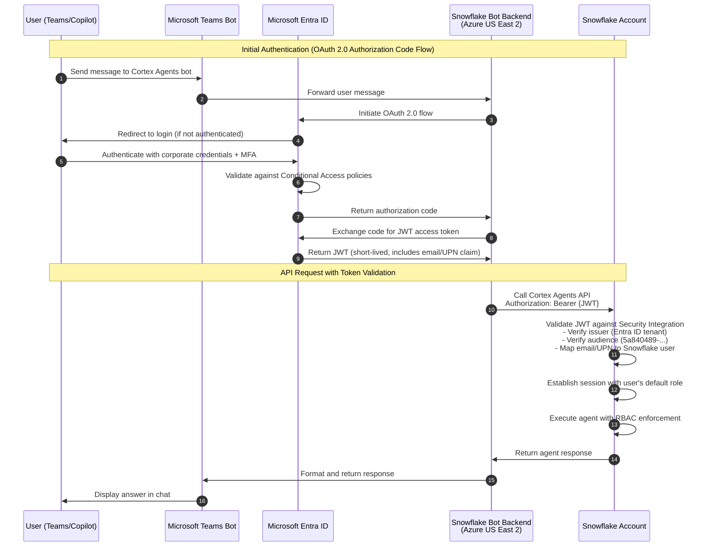
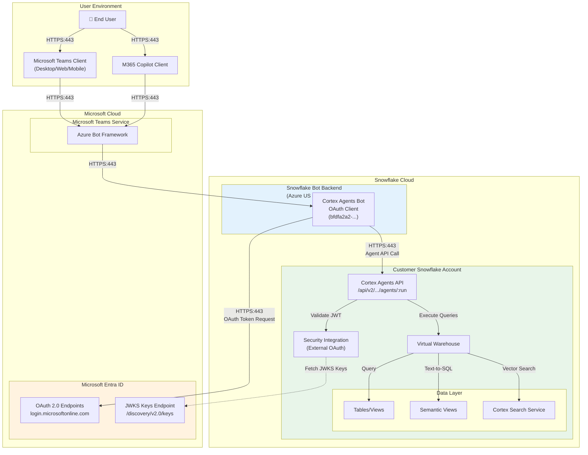
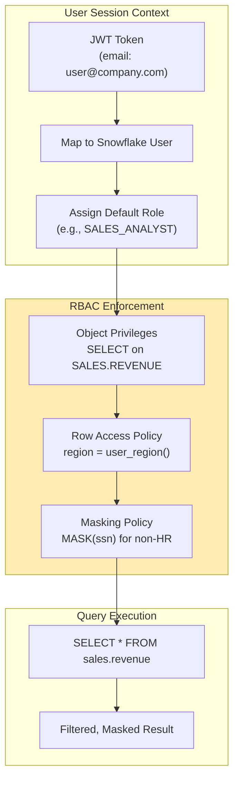

# Microsoft Copilot + Snowflake Cortex Agent Integration

Author: SE Community
Last Updated: 2026-01-07
Expires: 2026-02-07
Status: Reference Implementation


Reference Implementation: Review and customize for your requirements.

## Overview

This document describes the integration architecture between Microsoft 365 Copilot/Microsoft Teams and Snowflake Cortex Agents. The integration enables users to query Snowflake data using natural language directly from Teams or M365 Copilot, while maintaining enterprise-grade security controls.

## Use Case: Enterprise Sales Analytics via Copilot

**Scenario:** Sales team members need real-time access to pipeline metrics, revenue data, and customer insights without leaving Microsoft Teams or M365 Copilot.

**Solution:** A Cortex Agent configured with:
- **Cortex Analyst** tool for structured sales data queries (revenue, pipeline, forecasts)
- **Cortex Search** tool for unstructured data (sales playbooks, product documentation)
- Natural language interface accessible via Teams chat or M365 Copilot

**Example Interactions:**
- "What was our Q4 revenue by region?"
- "Show me the top 10 deals closing this month"
- "Find our pricing guidelines for enterprise customers"

---

## Architecture Diagrams

### Authentication Flow



### Network Flow



### Data Flow

```mermaid
flowchart LR
    subgraph Input["User Input"]
        NLQuery["Natural Language Query<br/>'What was Q4 revenue?'"]
    end

    subgraph BotProcessing["Bot Backend Processing"]
        AuthCheck["1. Authenticate User<br/>(OAuth JWT)"]
        RouteMsg["2. Route to Agent"]
    end

    subgraph CortexAgent["Cortex Agent Orchestration"]
        Orchestrator["3. LLM Orchestrator<br/>(claude-4-sonnet)"]
        ToolSelect["4. Tool Selection"]

        subgraph Tools["Available Tools"]
            Analyst["Cortex Analyst<br/>(Text-to-SQL)"]
            Search["Cortex Search<br/>(RAG)"]
            CustomTool["Custom Tools<br/>(UDFs/Procedures)"]
        end
    end

    subgraph DataAccess["Data Access (RBAC Enforced)"]
        SQLGen["5. Generate SQL"]
        Execute["6. Execute Query<br/>(User's Role Context)"]

        subgraph DataSources["Data Sources"]
            SalesDB[("Sales Database")]
            DocsSearch[("Document Index")]
        end
    end

    subgraph Output["Response"]
        Format["7. Format Response"]
        Response["Text / Table / Chart"]
    end

    NLQuery --> AuthCheck --> RouteMsg --> Orchestrator
    Orchestrator --> ToolSelect
    ToolSelect --> Analyst
    ToolSelect --> Search
    ToolSelect --> CustomTool
    Analyst --> SQLGen --> Execute
    Search --> Execute
    CustomTool --> Execute
    Execute --> SalesDB
    Execute --> DocsSearch
    SalesDB --> Format
    DocsSearch --> Format
    Format --> Response

    style Orchestrator fill:#e1bee7
    style Execute fill:#c8e6c9
```



---

## Security Architecture

### Trust Boundaries

| Boundary | Components | Trust Level |
|----------|-----------|-------------|
| User Device | Teams/Copilot Client | Untrusted |
| Microsoft Cloud | Entra ID, Bot Framework | Trusted (Microsoft-managed) |
| Snowflake Bot Backend | OAuth Client Service | Trusted (Snowflake-managed) |
| Customer Snowflake Account | Data, Agents, RBAC | Customer-controlled |

### Authentication Components

#### 1. Microsoft Entra ID Service Principals

Two applications must be consented in your Entra ID tenant:

| Application | App ID | Purpose |
|-------------|--------|---------|
| Cortex Agents Bot OAuth Resource | `5a840489-78db-4a42-8772-47be9d833efe` | Protected API resource (audience) |
| Cortex Agents Bot OAuth Client | `bfdfa2a2-bce5-4aee-ad3d-41ef70eb5086` | Client requesting tokens |

#### 2. Snowflake Security Integration

```sql
CREATE OR REPLACE SECURITY INTEGRATION entra_id_cortex_agents_integration
    TYPE = EXTERNAL_OAUTH
    ENABLED = TRUE
    EXTERNAL_OAUTH_TYPE = AZURE
    EXTERNAL_OAUTH_ISSUER = 'https://login.microsoftonline.com/<tenant-id>/v2.0'
    EXTERNAL_OAUTH_JWS_KEYS_URL = 'https://login.microsoftonline.com/<tenant-id>/discovery/v2.0/keys'
    EXTERNAL_OAUTH_AUDIENCE_LIST = ('5a840489-78db-4a42-8772-47be9d833efe')
    EXTERNAL_OAUTH_TOKEN_USER_MAPPING_CLAIM = ('email', 'upn')
    EXTERNAL_OAUTH_SNOWFLAKE_USER_MAPPING_ATTRIBUTE = 'email_address'
    EXTERNAL_OAUTH_ANY_ROLE_MODE = 'ENABLE';
```

### Identity Mapping

| Entra ID Claim | Snowflake Attribute | Notes |
|----------------|---------------------|-------|
| `email` | `EMAIL_ADDRESS` | Recommended for most deployments |
| `upn` | `LOGIN_NAME` | Alternative mapping option |

**Requirement:** 1:1 mapping between Entra ID users and Snowflake users.

---

## Access Control Model

### RBAC Enforcement

All queries execute under the authenticated user's **default Snowflake role**. The agent inherits:

- **Object-level access:** Only databases, schemas, tables the role can access
- **Row-level security:** Row access policies are enforced
- **Column-level security:** Dynamic data masking policies apply
- **Object masking:** Masking policies on sensitive columns apply



### Required Grants for Agent Usage

```sql
-- Grant agent usage
GRANT USAGE ON AGENT <db>.<schema>.<agent_name> TO ROLE <user_role>;

-- Grant underlying tool access
GRANT SELECT ON SEMANTIC VIEW <db>.<schema>.<semantic_view> TO ROLE <user_role>;
GRANT USAGE ON CORTEX SEARCH SERVICE <db>.<schema>.<search_svc> TO ROLE <user_role>;

-- Grant warehouse for query execution
GRANT USAGE ON WAREHOUSE <warehouse_name> TO ROLE <user_role>;
```

---

## Security Controls Summary

### Data Protection

| Control | Implementation | Status |
|---------|---------------|--------|
| Data at Rest Encryption | Snowflake-managed (AES-256) | ✅ Automatic |
| Data in Transit | TLS 1.2+ (all connections) | ✅ Enforced |
| Data Residency | Customer Snowflake account region | ✅ Customer-controlled |
| Data Never Leaves Snowflake | Query results processed in Snowflake | ✅ By design |

### Authentication & Authorization

| Control | Implementation | Status |
|---------|---------------|--------|
| User Authentication | OAuth 2.0 via Entra ID | ✅ Required |
| MFA Support | Entra ID Conditional Access | ✅ Supported |
| Role-Based Access | Snowflake RBAC | ✅ Enforced |
| Session Timeout | OAuth token expiration | ✅ Configurable |

### Audit & Compliance

| Control | Implementation | Status |
|---------|---------------|--------|
| Query Logging | Snowflake Query History | ✅ Automatic |
| Access Logging | Snowflake Access History | ✅ Automatic |
| User Activity | Snowflake Login History | ✅ Automatic |
| Agent Invocations | Cortex API logs | ✅ Available |

---

## Known Limitations

| Limitation | Impact | Mitigation |
|------------|--------|------------|
| No Private Link Support | Cannot use with Private Link accounts | Use public endpoints with network policies |
| No Network Policy Support | Network policies must be disabled | Rely on OAuth + RBAC for access control |
| Bot Backend in Azure US East 2 | Prompts/responses transit this region | Consent required for non-US-East-2 accounts |
| Default Role Only | Cannot use secondary roles dynamically | Configure DEFAULT_SECONDARY_ROLES = ('ALL') |
| Sovereign Cloud Unsupported | Not available in sovereign regions | N/A |

---

## Deployment Checklist

### Prerequisites
- [ ] Microsoft Entra ID Global Administrator access
- [ ] Snowflake ACCOUNTADMIN or SECURITYADMIN role
- [ ] Microsoft Tenant ID identified
- [ ] 1:1 user mapping strategy defined (email or UPN)

### Azure Configuration
- [ ] OAuth Resource principal consented (`5a840489-...`)
- [ ] OAuth Client principal consented (`bfdfa2a2-...`)
- [ ] Verify principals in Enterprise Applications

### Snowflake Configuration
- [ ] Security integration created with correct tenant ID
- [ ] User EMAIL_ADDRESS or LOGIN_NAME attributes populated
- [ ] Cortex Agent created with appropriate tools
- [ ] RBAC grants configured for target roles
- [ ] Warehouse configured for query execution

### Validation
- [ ] Test authentication flow with non-admin user
- [ ] Verify RBAC enforcement (user cannot see unauthorized data)
- [ ] Confirm masking policies apply through agent
- [ ] Review query history for audit trail

---

## References

- [Cortex Agents for Microsoft Teams and M365 Copilot Documentation](https://docs.snowflake.com/user-guide/snowflake-cortex/cortex-agents-teams-integration)
- [Cortex Agents REST API Reference](https://docs.snowflake.com/user-guide/snowflake-cortex/cortex-agents-rest-api)
- [Snowflake External OAuth Configuration](https://docs.snowflake.com/sql-reference/sql/create-security-integration-oauth-external)
- [Quickstart Guide](https://quickstarts.snowflake.com/guide/getting_started_with_the_microsoft_teams_and_365_copilot_cortex_app)
