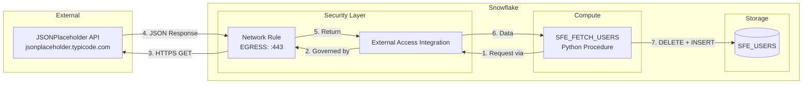

# Data Flow - API Data Fetcher

Author: SE Community
Last Updated: 2025-12-10
Expires: 2026-01-09

## Overview

Shows how data flows from external API through the stored procedure into Snowflake storage.

## Diagram



## Flow Steps

| Step | Action | Component | Details |
|------|--------|-----------|---------|
| 1 | Procedure initiates request | Procedure → EAI | Uses `requests.get()` |
| 2 | Security check | EAI → Network Rule | Validates destination allowed |
| 3 | HTTP request | Network Rule → API | `GET /users` |
| 4 | API response | API → Network Rule | JSON array of users |
| 5-6 | Data return | Network Rule → Procedure | Through EAI |
| 7 | Store data | Procedure → Table | Clear and reload pattern |

## Data Transformation

```
API JSON                    →  Snowflake Table
─────────────────────────      ────────────────
{                              SFE_USERS
  "id": 1,                     ├─ user_id: 1
  "name": "Leanne Graham",     ├─ name: "Leanne Graham"
  "username": "Bret",          ├─ username: "Bret"
  "email": "...",              ├─ email: "..."
  "phone": "...",              ├─ phone: "..."
  "website": "...",            ├─ website: "..."
  "company": {                 ├─ company_name: "Romaguera-Crona"
    "name": "Romaguera-Crona"  │   (flattened)
  },                           │
  "address": {                 └─ city: "Gwenborough"
    "city": "Gwenborough"          (flattened)
  }
}
```
