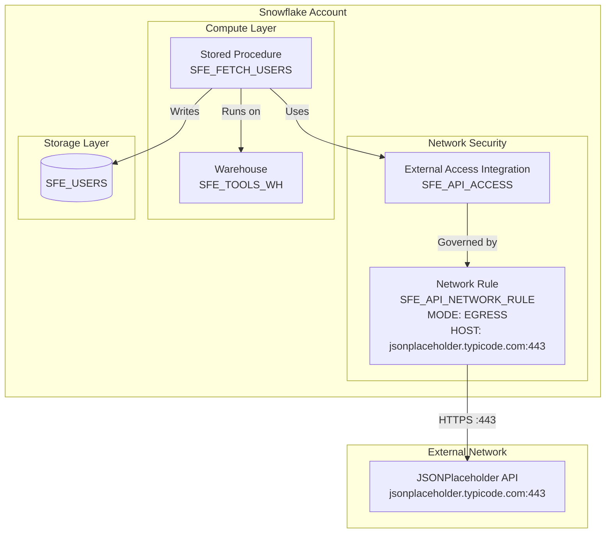

# Network Flow - API Data Fetcher

Author: SE Community  
Last Updated: 2025-12-10  
Expires: 2026-01-09

## Overview

Shows the network architecture enabling secure external API access from Snowflake.

## Diagram



## Security Components

### External Access Integration

```sql
CREATE EXTERNAL ACCESS INTEGRATION SFE_API_ACCESS
    ALLOWED_NETWORK_RULES = (SFE_API_NETWORK_RULE)
    ENABLED = TRUE;
```

- **Purpose:** Grants procedures permission to access external networks
- **Scope:** Only procedures explicitly referencing this integration

### Network Rule

```sql
CREATE NETWORK RULE SFE_API_NETWORK_RULE
    MODE = EGRESS
    TYPE = HOST_PORT
    VALUE_LIST = ('jsonplaceholder.typicode.com:443');
```

- **Mode:** EGRESS (outbound only)
- **Type:** HOST_PORT (specific host and port)
- **Restriction:** Only jsonplaceholder.typicode.com on port 443

## Security Model

| Layer | Control | What It Does |
|-------|---------|--------------|
| Network Rule | Allowlist | Restricts to specific hosts |
| External Access Integration | Permission | Links procedures to rules |
| Procedure | Reference | Must explicitly use integration |

**No integration = No external access.** Procedures cannot reach the internet without explicitly granted permissions.

