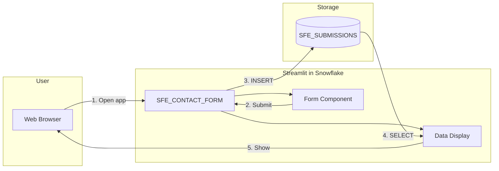

# Data Flow - Contact Form (Streamlit)

Author: SE Community  
Last Updated: 2025-12-10  
Expires: 2026-01-09

## Overview

Shows how form data flows from user input through the Streamlit app to storage in Snowflake.

## Diagram

## Flow Steps

| Step | Action | Component | SQL |
|------|--------|-----------|-----|
| 1 | User opens app | Browser → Streamlit | - |
| 2 | User submits form | Form → Handler | - |
| 3 | Insert submission | Handler → Table | `INSERT INTO SFE_SUBMISSIONS` |
| 4 | Fetch recent | Display ← Table | `SELECT ... ORDER BY submitted_at DESC` |
| 5 | Render results | Browser ← Display | - |

