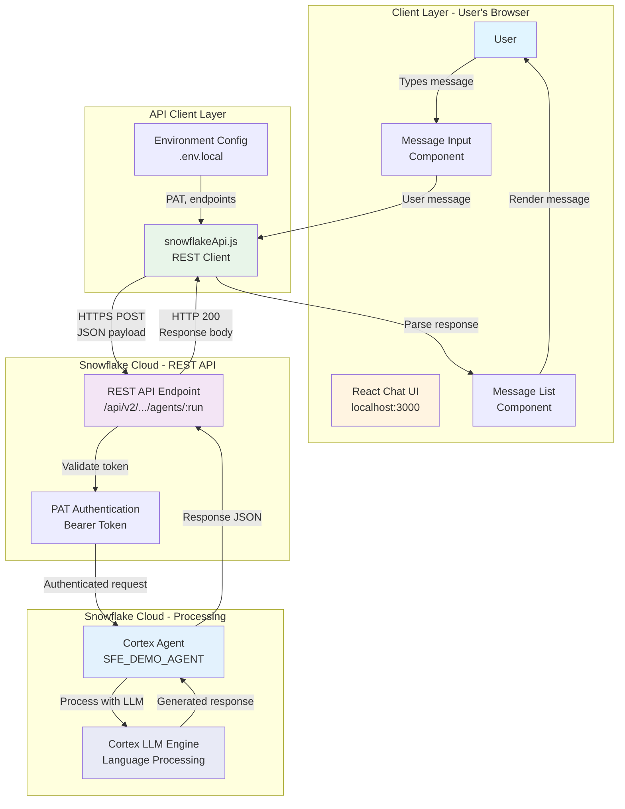

# Data Flow - Cortex Agent Chat (React UI)

Author: SE Community  
Last Updated: 2025-12-15  
Expires: 2026-01-14 (30 days from creation)  
Status: Reference Implementation


Reference Implementation: This code demonstrates production-grade architectural patterns and best practices. Review and customize security, networking, and logic for your organization's specific requirements before deployment.

## Overview

This diagram shows how user messages flow from the React UI through the REST API to the Cortex Agent and how responses return to the user interface.



## Component Descriptions

### Client Layer

**User**
- Purpose: End user interacting with the chat interface
- Technology: Web browser
- Location: User's machine
- Dependencies: Modern web browser (Chrome, Firefox, Safari, Edge)

**React Chat UI**
- Purpose: Single-page application providing chat interface
- Technology: React 18, Create React App
- Location: `src/` directory
- Dependencies: React DOM, CSS modules, environment configuration

**Message Input Component**
- Purpose: Text input field for user messages
- Technology: React functional component
- Location: `src/components/MessageInput.js`
- Dependencies: React state hooks, CSS styling

**Message List Component**
- Purpose: Displays conversation history
- Technology: React functional component with scrolling
- Location: `src/components/MessageList.js`
- Dependencies: Message component, auto-scroll logic

### API Client Layer

**snowflakeApi.js**
- Purpose: REST API client for Cortex Agent communication
- Technology: JavaScript Fetch API
- Location: `src/services/snowflakeApi.js`
- Dependencies: Environment variables, Bearer token authentication

**Environment Config**
- Purpose: Stores connection details and credentials
- Technology: Create React App environment variables
- Location: `.env.local` (not committed)
- Dependencies: None

### Snowflake REST API

**REST API Endpoint**
- Purpose: Public REST interface for Cortex Agent execution
- Technology: Snowflake REST API v2
- Location: `https://{account}.snowflakecomputing.com/api/v2/databases/{db}/schemas/{schema}/agents/{agent}:run`
- Dependencies: Valid account, database, schema, agent

**PAT Authentication**
- Purpose: Validates programmatic access tokens
- Technology: Snowflake authentication system
- Location: Snowflake account authentication layer
- Dependencies: Active PAT, network policy, user permissions

### Snowflake Processing

**Cortex Agent (SFE_DEMO_AGENT)**
- Purpose: AI-powered conversational agent
- Technology: Snowflake Cortex Agent
- Location: `SNOWFLAKE_EXAMPLE.SFE_CORTEX_AGENT_CHAT.SFE_DEMO_AGENT`
- Dependencies: Cortex service, agent instructions, usage grants

**Cortex LLM Engine**
- Purpose: Natural language processing and generation
- Technology: Snowflake Cortex AI (managed LLM service)
- Location: Snowflake platform service
- Dependencies: Cortex feature enabled, compute resources

## Data Flow Stages

| Stage | Input | Transformation | Output |
|-------|-------|----------------|--------|
| User Input | Keyboard text | Component state update | Message object |
| API Request | Message + Config | JSON serialization, HTTPS POST | REST API call |
| Authentication | PAT token | Token validation | Authenticated session |
| Agent Processing | User message | LLM inference, instruction following | AI response text |
| API Response | Agent output | JSON parsing | Message object |
| UI Rendering | Message object | React component render | Displayed message |

## Message Format

### Request Payload
```json
{
  "messages": [
    {
      "role": "user",
      "content": [
        {
          "type": "text",
          "text": "What is Snowflake?"
        }
      ]
    }
  ]
}
```

### Response Payload
```json
{
  "message": {
    "role": "assistant",
    "content": [
      {
        "type": "text",
        "text": "Snowflake is a cloud-based data warehouse..."
      }
    ]
  }
}
```

## Performance Characteristics

- **API Latency**: 500ms - 3s (depends on message complexity)
- **Network Overhead**: ~2KB per message exchange
- **UI Responsiveness**: <50ms render time
- **Conversation State**: Client-side only (no server persistence)

## Error Handling

1. **Network Errors**: Retry logic, timeout handling
2. **Authentication Errors**: Clear error messages, PAT validation
3. **API Errors**: Display Snowflake error messages
4. **Parsing Errors**: Fallback to raw response display

## Change History

See `.cursor/DIAGRAM_CHANGELOG.md` for version history.

---

*SE Community • Cortex Agent Chat Tool • Created: 2025-12-15 • Expires: 2026-01-14*

