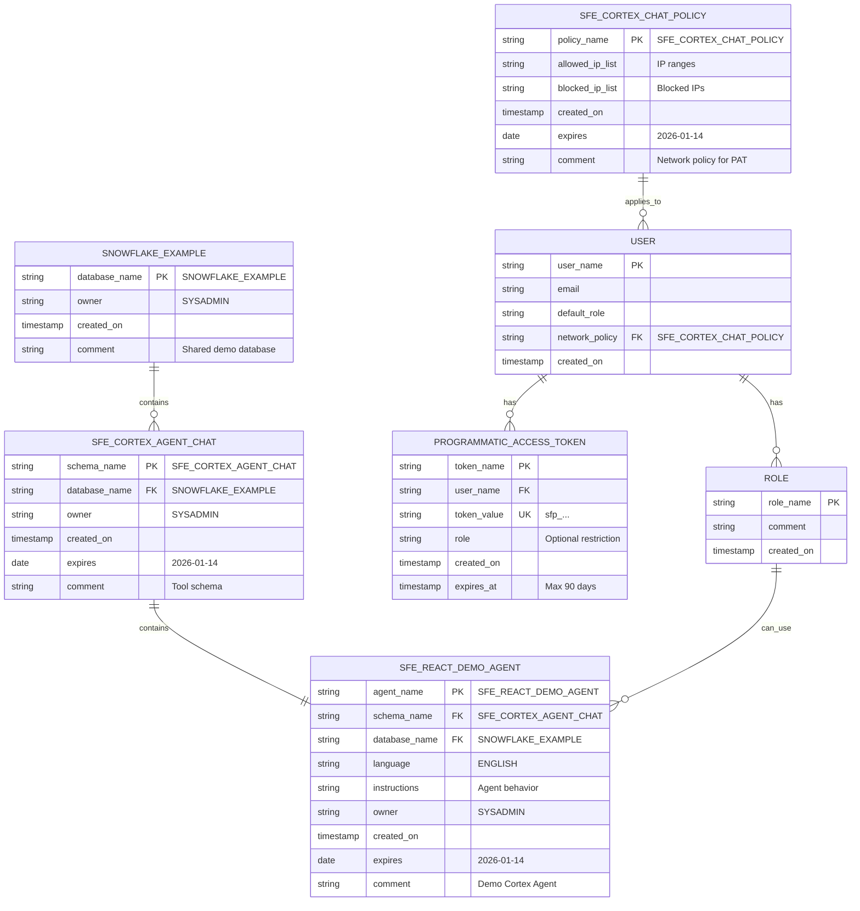

# Data Model - Cortex Agent Chat (React UI)

Author: SE Community  
Last Updated: 2025-12-15  
Expires: 2026-01-14 (30 days from creation)  
Status: Reference Implementation


Reference Implementation: This code demonstrates production-grade architectural patterns and best practices. Review and customize security, networking, and logic for your organization's specific requirements before deployment.

## Overview

This diagram shows the data model for the Cortex Agent Chat tool, including Snowflake objects and their relationships. This is a lightweight tool with minimal persistent data—conversation state is maintained client-side only.



## Component Descriptions

### Database Level

**SNOWFLAKE_EXAMPLE**
- Purpose: Shared demo database for all tools
- Technology: Snowflake database
- Location: Account-level object
- Dependencies: SYSADMIN role for creation
- Note: Shared across multiple tools, not tool-specific

### Schema Level

**SFE_CORTEX_AGENT_CHAT**
- Purpose: Logical container for Cortex Agent Chat objects
- Technology: Snowflake schema
- Location: `SNOWFLAKE_EXAMPLE.SFE_CORTEX_AGENT_CHAT`
- Dependencies: Parent database
- Cleanup: Dropped during teardown (CASCADE removes all contained objects)

### Agent Level

**SFE_REACT_DEMO_AGENT**
- Purpose: Sample Cortex Agent for chat interactions
- Technology: Snowflake Cortex Agent
- Location: Within schema
- Dependencies: Cortex service enabled, instructions defined
- Instructions: Pre-configured to answer Snowflake-related questions
- Lifecycle: Created by deploy.sql, dropped by teardown.sql

### Security Layer

**SFE_CORTEX_CHAT_POLICY**
- Purpose: Network policy controlling PAT access
- Technology: Snowflake Network Policy
- Location: Account-level security object
- Dependencies: None (account-level)
- Configuration: ALLOWED_IP_LIST (customize for production)
- Required: Users must have network policy to generate/use PATs

**USER**
- Purpose: Snowflake user account
- Technology: Snowflake user object
- Location: Account-level
- Dependencies: Network policy assignment
- Note: Pre-existing user, not created by this tool

**PROGRAMMATIC_ACCESS_TOKEN (PAT)**
- Purpose: API authentication credential
- Technology: Snowflake authentication token
- Location: Associated with user account
- Dependencies: User has network policy
- Format: `sfp_` prefix, 200+ character string
- Expiration: Maximum 90 days from creation
- Security: Stored in `.env.local` (gitignored)

**ROLE**
- Purpose: Defines permissions and access control
- Technology: Snowflake role object
- Location: Account-level
- Dependencies: Grants on agent object
- Example: SYSADMIN (default for tool)

## Object Hierarchy

```
Account
├── Database: SNOWFLAKE_EXAMPLE
│   └── Schema: SFE_CORTEX_AGENT_CHAT
│       └── Cortex Agent: SFE_REACT_DEMO_AGENT
│
├── Network Policy: SFE_CORTEX_CHAT_POLICY
│
├── Users
│   └── User: <your_username>
│       └── PAT: cortex_chat_token
│
└── Roles
    └── Role: SYSADMIN
        └── USAGE grant on SFE_REACT_DEMO_AGENT
```

## Data Persistence

### Snowflake Side

**Persistent Objects:**
- Database schema (until teardown)
- Cortex Agent definition (until teardown)
- Network policy (until manually dropped)
- PAT tokens (until revoked)
- Role grants (until revoked)

**No Persistent Data:**
- Conversation history (client-side only)
- User messages (not logged)
- Agent responses (not logged)

### Client Side (React App)

**Runtime State (Lost on Page Refresh):**
```javascript
// In-memory conversation state
const [messages, setMessages] = useState([
  {
    role: 'user',
    content: 'Hello',
    timestamp: '2025-12-15T10:30:00Z'
  },
  {
    role: 'assistant',
    content: 'Hi! How can I help?',
    timestamp: '2025-12-15T10:30:02Z'
  }
]);
```

**Configuration (Persistent in .env.local):**
```
REACT_APP_SNOWFLAKE_ACCOUNT=...
REACT_APP_SNOWFLAKE_DATABASE=...
REACT_APP_SNOWFLAKE_SCHEMA=...
REACT_APP_CORTEX_AGENT_NAME=...
REACT_APP_SNOWFLAKE_PAT=...
```

## Grants and Permissions

### Required Grants

```sql
-- Agent usage grant
GRANT USAGE ON CORTEX AGENT 
  SNOWFLAKE_EXAMPLE.SFE_CORTEX_AGENT_CHAT.SFE_REACT_DEMO_AGENT 
TO ROLE SYSADMIN;

-- Schema usage grant (implicit for owner)
GRANT USAGE ON SCHEMA 
  SNOWFLAKE_EXAMPLE.SFE_CORTEX_AGENT_CHAT 
TO ROLE SYSADMIN;

-- Database usage grant (implicit for owner)
GRANT USAGE ON DATABASE SNOWFLAKE_EXAMPLE 
TO ROLE SYSADMIN;
```

### Grant Propagation

```
Role: SYSADMIN
  ↓ has USAGE grant
Cortex Agent: SFE_REACT_DEMO_AGENT
  ↓ invoked via
REST API (with PAT for SYSADMIN role)
  ↓ processes
User Message → Agent Response
```

## Comparison with Other Tools

| Tool | Data Model | Persistent Storage | Client-Side State |
|------|------------|-------------------|-------------------|
| **Cortex Agent Chat** | Minimal (agent only) | None | Conversation history |
| API Data Fetcher | Tables for API data | Yes (fetched records) | None |
| Wallmonitor | Views over ACCOUNT_USAGE | No (computed views) | None |
| Contact Form | Tables for submissions | Yes (form records) | None |

## Extensibility

### Adding Conversation History

To persist conversations:

```sql
-- Add conversation logging table
CREATE TABLE SFE_CONVERSATION_HISTORY (
    conversation_id STRING PRIMARY KEY,
    user_name STRING,
    message_role STRING,  -- 'user' or 'assistant'
    message_text STRING,
    timestamp TIMESTAMP_LTZ DEFAULT CURRENT_TIMESTAMP(),
    session_id STRING
);

-- Add to React app:
// Store after each message exchange
await storeConversation(conversationId, messages);
```

### Adding Multiple Agents

```sql
-- Create additional agents
CREATE CORTEX AGENT SFE_SALES_AGENT
    LANGUAGE = 'ENGLISH'
    INSTRUCTIONS = 'Sales-focused assistant...'
    COMMENT = 'DEMO: Sales agent | Expires: 2026-01-14';

CREATE CORTEX AGENT SFE_SUPPORT_AGENT
    LANGUAGE = 'ENGLISH'
    INSTRUCTIONS = 'Support-focused assistant...'
    COMMENT = 'DEMO: Support agent | Expires: 2026-01-14';

-- React app: Add agent selector dropdown
```

### Adding User Context

```sql
-- Store user preferences
CREATE TABLE SFE_USER_PREFERENCES (
    user_name STRING PRIMARY KEY,
    preferred_agent STRING,
    theme STRING,
    language STRING,
    created_at TIMESTAMP_LTZ DEFAULT CURRENT_TIMESTAMP()
);
```

## Change History

See `.cursor/DIAGRAM_CHANGELOG.md` for version history.

---

*SE Community • Cortex Agent Chat Tool • Created: 2025-12-15 • Expires: 2026-01-14*

