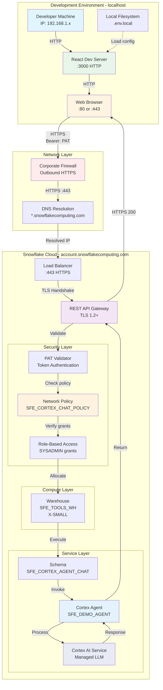

# Network Flow - Cortex Agent Chat (React UI)

Author: SE Community  
Last Updated: 2025-12-15  
Expires: 2026-01-14 (30 days from creation)  
Status: Reference Implementation


Reference Implementation: This code demonstrates production-grade architectural patterns and best practices. Review and customize security, networking, and logic for your organization's specific requirements before deployment.

## Overview

This diagram shows the network architecture and connectivity between the React application, Snowflake REST API, and Cortex Agent services, including security boundaries and protocols.



## Component Descriptions

### Development Environment

**Developer Machine**
- Purpose: Local development workstation
- Technology: macOS, Linux, or Windows
- Location: Developer's network
- Dependencies: Internet connectivity, modern OS
- Network: Outbound HTTPS required (port 443)

**Web Browser**
- Purpose: Renders React UI and handles HTTP requests
- Technology: Chrome, Firefox, Safari, Edge (modern versions)
- Location: localhost
- Dependencies: JavaScript enabled, local storage
- Ports: HTTP :80, HTTPS :443 (for external requests)

**React Dev Server**
- Purpose: Serves React application during development
- Technology: Create React App development server (Webpack)
- Location: localhost:3000
- Dependencies: Node.js 14+, npm packages
- Ports: HTTP :3000 (configurable)

**Local Filesystem**
- Purpose: Stores configuration and credentials
- Technology: `.env.local` file (gitignored)
- Location: Project root directory
- Dependencies: None
- Security: Must not be committed to version control

### Network Layer

**Corporate Firewall**
- Purpose: Outbound traffic filtering and security
- Technology: Enterprise firewall (varies)
- Location: Network perimeter
- Dependencies: HTTPS outbound allowed to Snowflake
- Ports: :443 outbound required
- Configuration: Allow `*.snowflakecomputing.com`

**DNS Resolution**
- Purpose: Resolves Snowflake account hostnames
- Technology: DNS (Domain Name System)
- Location: Corporate or public DNS servers
- Dependencies: Connectivity to DNS servers
- Resolution: `{account}.snowflakecomputing.com` → IP address

### Snowflake Cloud

**Load Balancer**
- Purpose: Distributes incoming REST API requests
- Technology: Snowflake managed load balancer
- Location: Snowflake cloud infrastructure
- Dependencies: TLS certificates, health checks
- Ports: :443 HTTPS
- Protocol: TLS 1.2 or higher

**REST API Gateway**
- Purpose: Handles REST API requests and routing
- Technology: Snowflake REST API v2
- Location: `https://{account}.snowflakecomputing.com/api/v2/`
- Dependencies: Valid authentication, request validation
- Endpoints: `/databases/{db}/schemas/{schema}/agents/{agent}:run`

### Security Layer

**Network Policy (SFE_CORTEX_CHAT_POLICY)**
- Purpose: Controls IP-based access to Snowflake
- Technology: Snowflake Network Policy
- Location: Account-level security configuration
- Dependencies: User association, IP allowlist
- Configuration: ALLOWED_IP_LIST (customize for production)

**PAT Validator**
- Purpose: Authenticates Programmatic Access Tokens
- Technology: Snowflake authentication service
- Location: Snowflake identity platform
- Dependencies: Valid PAT, user association, expiration check
- Headers: `Authorization: Bearer {PAT}`

**Role-Based Access Control (RBAC)**
- Purpose: Validates user permissions for agent usage
- Technology: Snowflake grants and roles
- Location: Access control metadata
- Dependencies: USAGE grant on agent, appropriate role
- Required Grants: `GRANT USAGE ON CORTEX AGENT ... TO ROLE SYSADMIN`

### Compute Layer

**Warehouse (SFE_TOOLS_WH)**
- Purpose: Provides compute resources for operations
- Technology: Snowflake virtual warehouse
- Location: Snowflake compute layer
- Dependencies: Active warehouse, available credits
- Size: X-SMALL (sufficient for agent operations)
- Auto-suspend: 60 seconds

### Service Layer

**Schema (SFE_CORTEX_AGENT_CHAT)**
- Purpose: Logical container for agent objects
- Technology: Snowflake schema
- Location: `SNOWFLAKE_EXAMPLE.SFE_CORTEX_AGENT_CHAT`
- Dependencies: Database existence, schema permissions

**Cortex Agent (SFE_DEMO_AGENT)**
- Purpose: Conversational AI agent instance
- Technology: Snowflake Cortex Agent
- Location: Within schema
- Dependencies: Cortex service enabled, agent instructions

**Cortex AI Service**
- Purpose: Managed LLM inference service
- Technology: Snowflake Cortex AI platform
- Location: Snowflake managed service
- Dependencies: Cortex feature enabled, sufficient compute

## Network Security

### Transport Security

| Layer | Protocol | Encryption | Port |
|-------|----------|------------|------|
| Browser → Dev Server | HTTP | None (localhost) | 3000 |
| Browser → Snowflake | HTTPS | TLS 1.2+ | 443 |
| API → Cortex | Internal | Snowflake managed | N/A |

### Authentication Flow

1. **Token Generation**: User creates PAT via Snowsight or SQL
2. **Token Storage**: PAT stored in `.env.local` (not committed)
3. **Token Transmission**: PAT sent as Bearer token in Authorization header
4. **Token Validation**: Snowflake validates token, user, network policy
5. **Permission Check**: RBAC validates usage grants on agent
6. **Request Processing**: Agent invocation proceeds if authorized

### Firewall Requirements

**Outbound Rules (Required):**
```
Protocol: HTTPS (TCP)
Port: 443
Destination: *.snowflakecomputing.com
Direction: Outbound
```

**Inbound Rules (Development Only):**
```
Protocol: HTTP
Port: 3000
Source: localhost (127.0.0.1)
Direction: Inbound (local only)
```

## Production Considerations

### Network Policy Hardening

```sql
-- Restrict to specific IP ranges (recommended for production)
CREATE NETWORK POLICY SFE_CORTEX_CHAT_POLICY
    ALLOWED_IP_LIST = (
        '203.0.113.0/24',     -- Corporate office
        '198.51.100.0/24'     -- VPN range
    )
    BLOCKED_IP_LIST = (
        '192.0.2.0/24'        -- Known bad actors
    );
```

### CORS Configuration

Not applicable for this architecture—PAT authentication avoids CORS issues. If hosting React app on a web server (production), ensure proper domain configuration.

### Rate Limiting

Snowflake REST API includes built-in rate limiting:
- Consult Snowflake documentation for current limits
- Implement client-side retry with exponential backoff
- Monitor usage via `ACCOUNT_USAGE.REST_EVENT_HISTORY`

## Troubleshooting Network Issues

### Cannot Reach Snowflake

**Symptoms:** Network timeouts, DNS errors  
**Check:**
1. Firewall allows outbound HTTPS (:443)
2. DNS resolution works: `nslookup {account}.snowflakecomputing.com`
3. No corporate proxy blocking Snowflake domains

### 401 Unauthorized

**Symptoms:** Authentication failure  
**Check:**
1. PAT is valid and not expired
2. PAT user has network policy assigned
3. Request IP is in network policy ALLOWED_IP_LIST

### 403 Forbidden

**Symptoms:** Permission denied  
**Check:**
1. User has USAGE grant on agent
2. Role associated with PAT has appropriate permissions
3. Network policy allows connection

## Change History

See `.cursor/DIAGRAM_CHANGELOG.md` for version history.

---

*SE Community • Cortex Agent Chat Tool • Created: 2025-12-15 • Expires: 2026-01-14*

