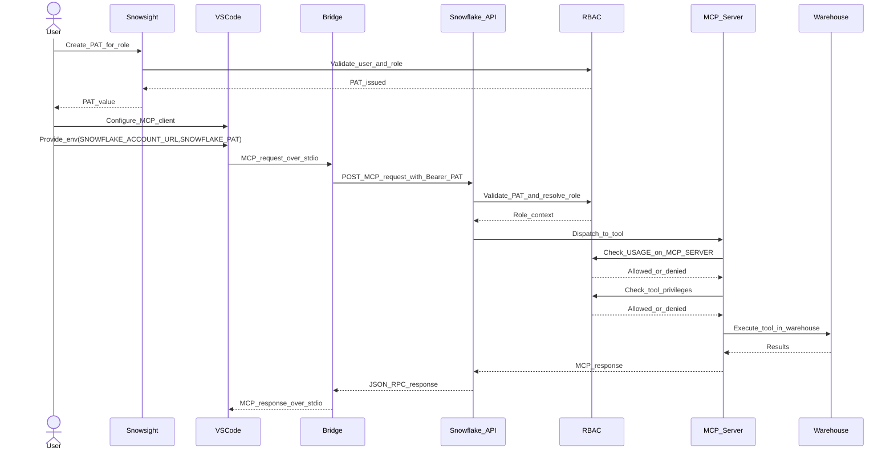

# Auth Flow - MCP Snowflake Bridge (VS Code)
Author: SE Community
Last Updated: 2026-01-05
Expires: 2026-02-04 (30 days)
Status: Reference Implementation

Reference Implementation: This code demonstrates production-grade architectural patterns and best practices. Review and customize security, networking, and logic for your organization's specific requirements before deployment.

## Overview
This diagram shows how authentication and authorization work for a VS Code MCP client connecting to Snowflake using a Programmatic Access Token (PAT). The PAT determines the Snowflake role used for RBAC checks on the MCP server and underlying tools.

## Component Descriptions
- Snowsight
  - Purpose: UI to create Programmatic Access Tokens (PAT)
  - Technology: Snowflake web UI
  - Location: Snowflake account
  - Deps: User privileges to create PATs

- Python_Bridge
  - Purpose: Forwards MCP calls from VS Code (stdio) to Snowflake (HTTPS)
  - Technology: Python
  - Location: `tools/mcp-catalog-concierge/python/mcp_bridge.py`
  - Deps: PAT stored outside the repo (env var)

- MCP_Server
  - Purpose: Defines MCP tool catalog and routes tool calls
  - Technology: Snowflake-managed MCP server object
  - Location: `SNOWFLAKE_EXAMPLE.MCP_SNOWFLAKE_BRIDGE.MCP_SNOWFLAKE_BRIDGE`
  - Deps: RBAC grants on MCP server + underlying tools

- RBAC
  - Purpose: Enforces authorization at MCP server and tool levels
  - Technology: Snowflake RBAC
  - Location: Snowflake control plane
  - Deps: Role grants for MCP server, warehouse, function, and queried objects

## Change History
See `.cursor/DIAGRAM_CHANGELOG.md` for vhistory.

