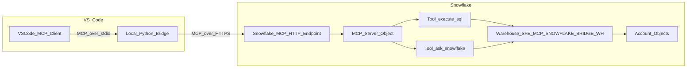

# Data Flow - MCP Snowflake Bridge (VS Code)
Author: SE Community
Last Updated: 2026-01-05
Expires: 2026-02-04 (30 days)
Status: Reference Implementation

Reference Implementation: This code demonstrates production-grade architectural patterns and best practices. Review and customize security, networking, and logic for your organization's specific requirements before deployment.

## Overview
This diagram shows how an MCP tool call flows from a VS Code client to a Snowflake-managed MCP server. This demo does not ingest or create business data; it provides a standard interface to query data that already exists in your Snowflake account.

## Component Descriptions
- VSCode_MCP_Client
  - Purpose: VS Code UI that discovers and calls MCP tools
  - Technology: VS Code extension (Continue/Cline/Copilot)
  - Location: User workstation
  - Deps: User-configured LLM provider (client-side) + Snowflake PAT

- Local_Python_Bridge
  - Purpose: Proxies MCP requests from stdio to Snowflake-managed MCP over HTTPS
  - Technology: Python + requests
  - Location: `tools/mcp-catalog-concierge/python/mcp_bridge.py`
  - Deps: `tools/mcp-catalog-concierge/python/requirements.txt`

- Snowflake_MCP_HTTP_Endpoint
  - Purpose: Hosted MCP endpoint in your Snowflake account (JSON-RPC over HTTPS)
  - Technology: Snowflake-managed MCP server
  - Location: `/api/v2/databases/SNOWFLAKE_EXAMPLE/schemas/MCP_SNOWFLAKE_BRIDGE/mcp-servers/MCP_SNOWFLAKE_BRIDGE`
  - Deps: Snowflake RBAC (USAGE on MCP server + tool dependencies)

- Warehouse_SFE_MCP_SNOWFLAKE_BRIDGE_WH
  - Purpose: Compute for tool execution (SQL + helper function)
  - Technology: Snowflake warehouse
  - Location: Created by `tools/mcp-catalog-concierge/sql/01_setup.sql`
  - Deps: Role must have `USAGE` on warehouse to invoke tools

## Change History
See `.cursor/DIAGRAM_CHANGELOG.md` for vhistory.

