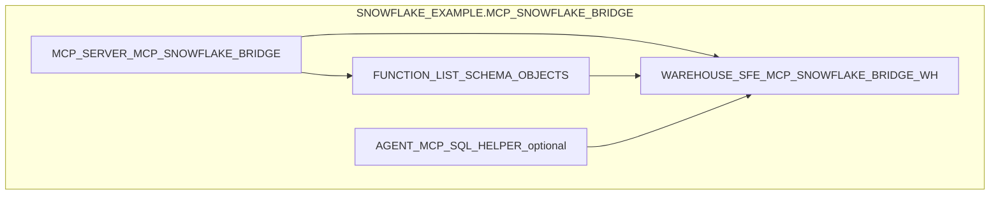

# Data Model - MCP Snowflake Bridge (VS Code)
Author: SE Community
Last Updated: 2026-01-05
Expires: 2026-02-04 (30 days)
Status: Reference Implementation

Reference Implementation: This code demonstrates production-grade architectural patterns and best practices. Review and customize security, networking, and logic for your organization's specific requirements before deployment.

## Overview
This demo intentionally does not create business tables. Instead, it creates a small set of objects in a project schema that expose an MCP tool interface to query your existing Snowflake data.

## Component Descriptions
- MCP_SERVER_MCP_SNOWFLAKE_BRIDGE
  - Purpose: Defines MCP tools and exposes them via Snowflake API v2
  - Technology: Snowflake-managed MCP server
  - Location: `tools/mcp-catalog-concierge/sql/02_mcp_server.sql`
  - Deps: `sql/00_config.sql`, `sql/01_setup.sql`

- FUNCTION_LIST_SCHEMA_OBJECTS
  - Purpose: Returns a JSON snapshot of tables/views in the current schema for routing
  - Technology: SQL UDF returning VARIANT
  - Location: `tools/mcp-catalog-concierge/sql/01_setup.sql`
  - Deps: Warehouse access for execution

- WAREHOUSE_SFE_MCP_SNOWFLAKE_BRIDGE_WH
  - Purpose: Compute for tool execution
  - Technology: Snowflake warehouse
  - Location: `tools/mcp-catalog-concierge/sql/01_setup.sql`
  - Deps: Role must have `USAGE` on warehouse

- AGENT_MCP_SQL_HELPER_optional
  - Purpose: Optional helper agent for SQL drafting guidance (not wired into MCP server)
  - Technology: Cortex Agent
  - Location: `tools/mcp-catalog-concierge/sql/03_agent.sql`
  - Deps: Cortex feature availability

## Change History
See `.cursor/DIAGRAM_CHANGELOG.md` for vhistory.

