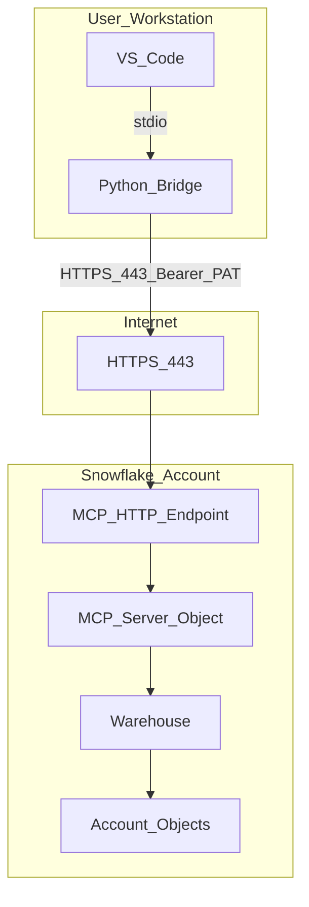

# Network Flow - MCP Snowflake Bridge (VS Code)
Author: SE Community
Last Updated: 2026-01-05
Expires: 2026-02-04 (30 days)
Status: Reference Implementation

Reference Implementation: This code demonstrates production-grade architectural patterns and best practices. Review and customize security, networking, and logic for your organization's specific requirements before deployment.

## Overview
This diagram shows how a VS Code MCP client connects to a Snowflake-managed MCP server. VS Code talks MCP over stdio to a local bridge process, which then talks MCP over HTTPS to Snowflake.

## Component Descriptions
- VS_Code
  - Purpose: MCP client UI inside VS Code
  - Technology: VS Code extension
  - Location: User workstation
  - Deps: Configured MCP server command + environment variables

- Python_Bridge
  - Purpose: stdio-to-HTTP proxy for Snowflake-managed MCP server
  - Technology: Python
  - Location: `tools/mcp-catalog-concierge/python/mcp_bridge.py`
  - Deps: Outbound HTTPS access to your Snowflake account URL

- MCP_HTTP_Endpoint
  - Purpose: Snowflake API v2 endpoint that accepts MCP JSON-RPC requests
  - Technology: Snowflake-managed MCP server
  - Location: `/api/v2/databases/SNOWFLAKE_EXAMPLE/schemas/MCP_SNOWFLAKE_BRIDGE/mcp-servers/MCP_SNOWFLAKE_BRIDGE`
  - Deps: PAT (Bearer) or OAuth

- Warehouse
  - Purpose: Executes SQL and helper function calls invoked by MCP tools
  - Technology: Snowflake warehouse
  - Location: `SFE_MCP_SNOWFLAKE_BRIDGE_WH`
  - Deps: `USAGE` privilege granted to the PAT role

## Change History
See `.cursor/DIAGRAM_CHANGELOG.md` for vhistory.

