# Multi-Tenant Snowflake Agent - Visual Diagrams

Visual representations of the multi-tenant architecture using Azure AD OAuth and Row Access Policies.

## 1. High-Level System Architecture

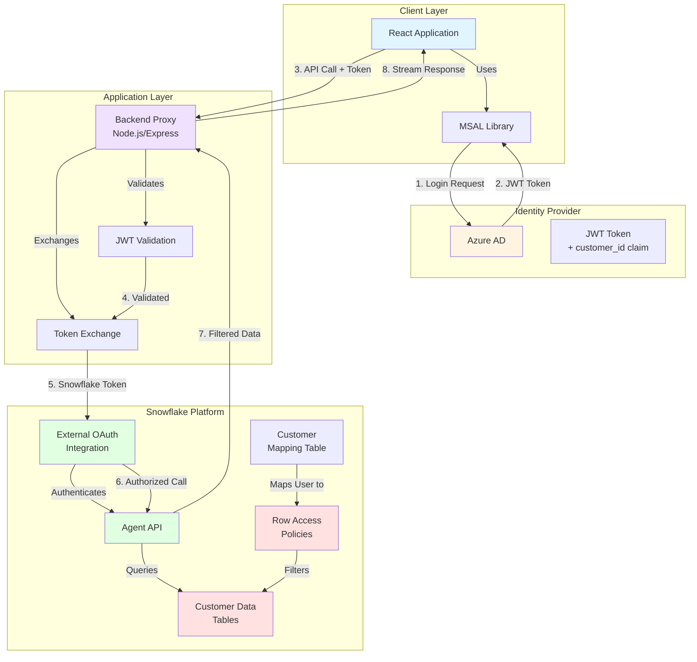

## 2. Authentication Flow

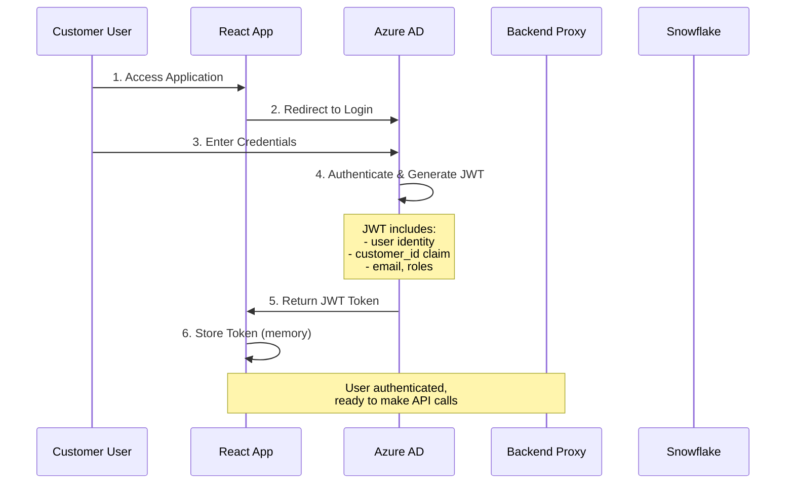

## 3. Agent Query Flow with Row Access Policies

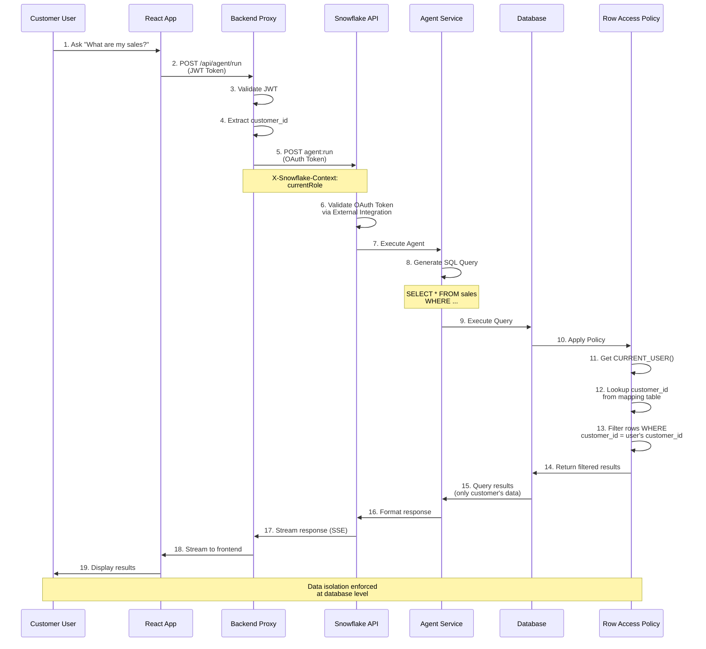

## 4. Row Access Policy Mechanism

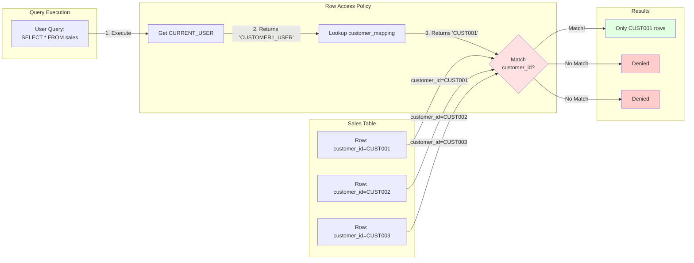

## 5. Security Layers

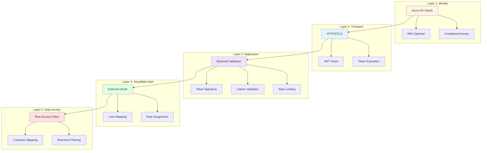

## 6. Data Model

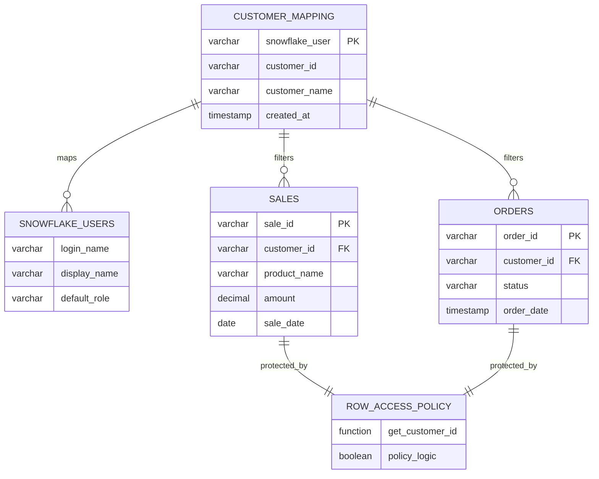

## 7. Component Interaction Flow

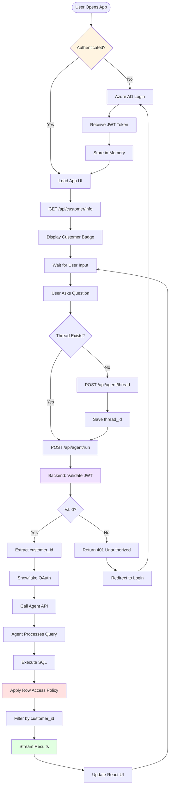

## 8. Token Flow Diagram

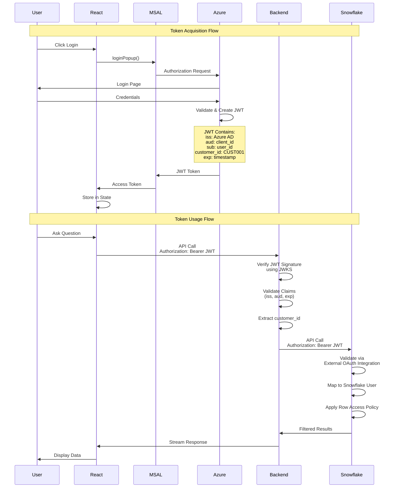

## 9. Deployment Architecture

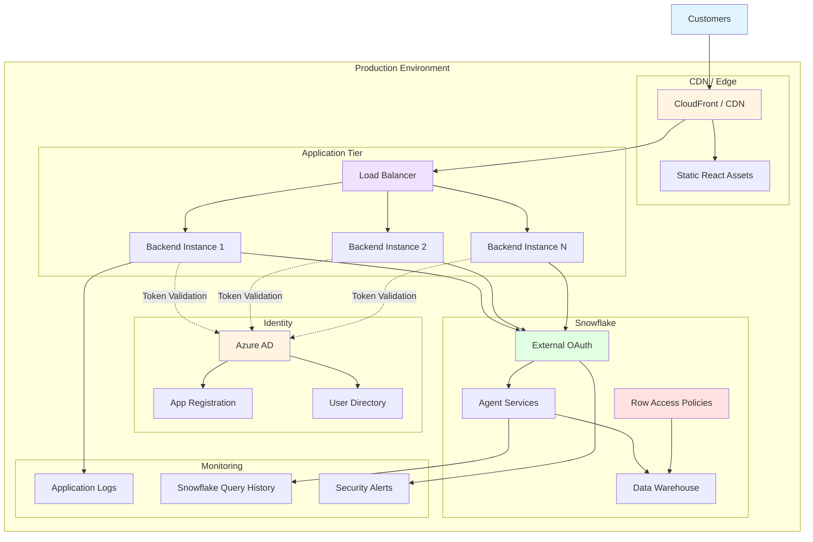

## 10. Error Handling Flow

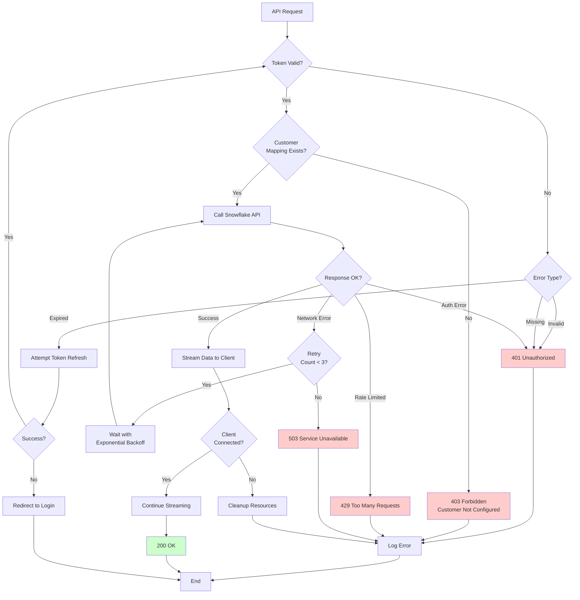

## 11. Customer Onboarding Flow

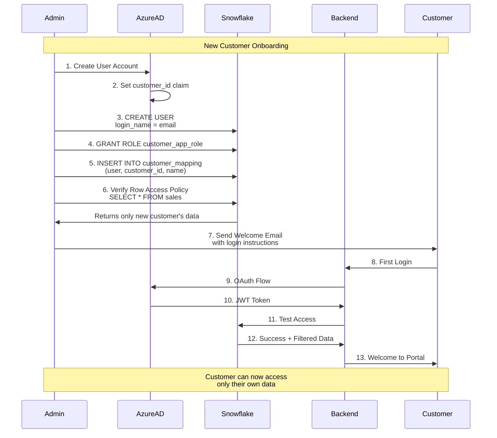

## 12. Multi-Customer Isolation

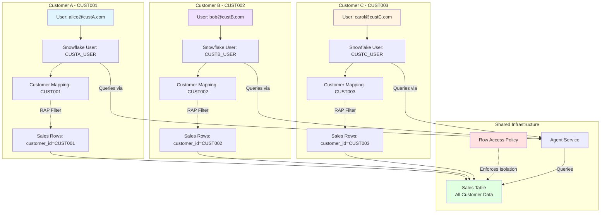

---

## Diagram Usage Guide

### When to Use Each Diagram:

1. **High-Level System Architecture**: Executive overview, system design discussions
2. **Authentication Flow**: Understanding OAuth integration, security reviews
3. **Agent Query Flow**: Debugging query issues, performance optimization
4. **Row Access Policy Mechanism**: Explaining data isolation to stakeholders
5. **Security Layers**: Security audits, compliance documentation
6. **Data Model**: Database design, schema documentation
7. **Component Interaction**: Developer onboarding, troubleshooting
8. **Token Flow**: Security implementation details
9. **Deployment Architecture**: Infrastructure planning, scaling discussions
10. **Error Handling**: Resilience planning, monitoring setup
11. **Customer Onboarding**: Operations documentation
12. **Multi-Customer Isolation**: Explaining multi-tenancy to customers

### Rendering These Diagrams:

Most modern markdown viewers support Mermaid diagrams:
- **GitHub**: Native support
- **GitLab**: Native support
- **VS Code**: Install "Markdown Preview Mermaid Support" extension
- **Browser**: Use [Mermaid Live Editor](https://mermaid.live)
- **Documentation**: Supports Mermaid (MkDocs, Docusaurus, etc.)

### Exporting as Images:

```bash
# Using Mermaid CLI
npm install -g @mermaid-js/mermaid-cli
mmdc -i diagrams.md -o diagrams.pdf
```
