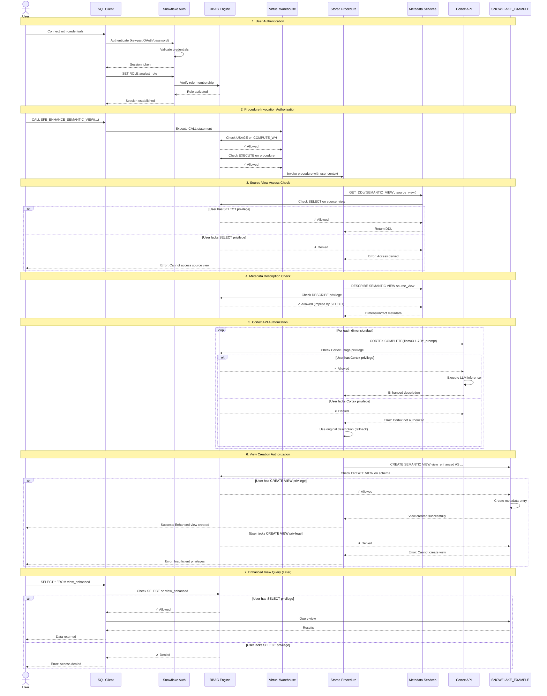

# Auth Flow - Better Descriptions

**Author:** SE Community  
**Last Updated:** 2025-11-21  
**Status:** Reference Implementation


**Reference Implementation:** This code demonstrates production-grade architectural patterns and best practices. Review and customize security, networking, and logic for your organization's specific requirements before deployment.

## Overview

This diagram illustrates the authentication and authorization flows for the Better Descriptions tool. The system leverages Snowflake's native Role-Based Access Control (RBAC) to enforce security at every layer: user authentication, procedure execution, metadata access, Cortex API usage, and view creation. All permissions are enforced through standard Snowflake roles and privileges.

## Diagram



## Authentication Methods

### Supported Authentication Types

| Method | Use Case | Security Level | Recommended For |
|--------|----------|---------------|-----------------|
| **Key-Pair Authentication** | Automation, service accounts | ⭐⭐⭐⭐⭐ High | **Production automation** |
| **OAuth 2.0** | Enterprise SSO, applications | ⭐⭐⭐⭐⭐ High | **Interactive users with SSO** |
| **Username/Password** | Interactive users, testing | ⭐⭐⭐ Medium | Development/testing |
| **MFA (Multi-Factor)** | High-security environments | ⭐⭐⭐⭐⭐ Very High | **Production interactive users** |

### Authentication Flow Details

#### 1. Key-Pair Authentication (Recommended)
```sql
-- User authenticates with private key (managed externally)
-- No password transmitted over network
-- Snowflake validates signature using public key

-- Key creation (done once)
-- Generate RSA key pair: openssl genrsa 2048 | openssl pkcs8 -topk8 -inform PEM -out rsa_key.p8
-- Extract public key: openssl rsa -in rsa_key.p8 -pubout -out rsa_key.pub

-- Associate public key with user
ALTER USER analyst_user SET RSA_PUBLIC_KEY='MIIBIjANBgkq...';

-- Client uses private key for authentication (automatic in connection)
```

#### 2. OAuth 2.0 (Enterprise SSO)
```
1. User initiates login
2. Redirected to Identity Provider (e.g., Okta, Azure AD)
3. IdP validates credentials
4. IdP issues OAuth token
5. Snowflake validates token
6. Session established
```

#### 3. Username/Password
```sql
-- Standard credentials
-- Should be combined with MFA in production
-- Password complexity enforced by Snowflake password policy

-- Example password policy
CREATE PASSWORD POLICY strict_policy
  PASSWORD_MIN_LENGTH = 12
  PASSWORD_MAX_LENGTH = 256
  PASSWORD_MIN_UPPER_CASE_CHARS = 1
  PASSWORD_MIN_LOWER_CASE_CHARS = 1
  PASSWORD_MIN_NUMERIC_CHARS = 1
  PASSWORD_MIN_SPECIAL_CHARS = 1;
```

## Authorization Model (RBAC)

### Role Hierarchy

```
                    ACCOUNTADMIN
                         |
            +------------+------------+
            |                         |
        SYSADMIN                  SECURITYADMIN
            |                         |
    +-------+-------+          (Manages users/roles)
    |               |
DATA_ENGINEER   ANALYST_ROLE
(Setup)         (Usage)
```

### Required Privileges by Role

#### Setup Role (e.g., DATA_ENGINEER, SYSADMIN)

**Purpose:** Initial setup and procedure deployment

```sql
-- Database and schema creation
GRANT CREATE DATABASE ON ACCOUNT TO ROLE data_engineer;

-- Or use existing database
GRANT USAGE ON DATABASE SNOWFLAKE_EXAMPLE TO ROLE data_engineer;
GRANT CREATE SCHEMA ON DATABASE SNOWFLAKE_EXAMPLE TO ROLE data_engineer;

-- Schema privileges
GRANT USAGE ON SCHEMA SNOWFLAKE_EXAMPLE.SEMANTIC_ENHANCEMENTS TO ROLE data_engineer;
GRANT CREATE PROCEDURE ON SCHEMA SNOWFLAKE_EXAMPLE.SEMANTIC_ENHANCEMENTS TO ROLE data_engineer;
GRANT CREATE VIEW ON SCHEMA SNOWFLAKE_EXAMPLE.SEMANTIC_ENHANCEMENTS TO ROLE data_engineer;

-- Warehouse usage
GRANT USAGE ON WAREHOUSE COMPUTE_WH TO ROLE data_engineer;

-- Cortex privilege (requires ACCOUNTADMIN)
-- Must be granted by ACCOUNTADMIN
GRANT CREATE CORTEX MODEL ON ACCOUNT TO ROLE data_engineer; -- For Cortex usage
```

#### Usage Role (e.g., ANALYST_ROLE)

**Purpose:** Run enhancement procedure on existing views

```sql
-- Execute the procedure
GRANT USAGE ON SCHEMA SNOWFLAKE_EXAMPLE.SEMANTIC_ENHANCEMENTS TO ROLE analyst_role;
GRANT EXECUTE ON PROCEDURE SFE_ENHANCE_SEMANTIC_VIEW(...) TO ROLE analyst_role;

-- Access source views (must grant per source)
GRANT SELECT ON VIEW source_schema.source_view TO ROLE analyst_role;

-- Create enhanced views
GRANT CREATE VIEW ON SCHEMA target_schema TO ROLE analyst_role;

-- Warehouse usage
GRANT USAGE ON WAREHOUSE COMPUTE_WH TO ROLE analyst_role;

-- Cortex privilege (requires ACCOUNTADMIN delegation)
GRANT CREATE CORTEX MODEL ON ACCOUNT TO ROLE analyst_role;
```

### Privilege Validation Points

| Action | Required Privilege | Validation Point | Failure Message |
|--------|-------------------|------------------|-----------------|
| Connect to Snowflake | Valid credentials | Authentication service | "Authentication failed" |
| Activate role | `GRANT ROLE TO USER` | Role membership check | "Role not granted" |
| Use warehouse | `USAGE` on warehouse | Warehouse execution | "Warehouse not accessible" |
| Call procedure | `EXECUTE` on procedure | Procedure invocation | "Insufficient privileges" |
| Read source view DDL | `SELECT` on view | GET_DDL execution | "Object does not exist" |
| Describe source view | `DESCRIBE` on view | DESCRIBE execution | "Object does not exist" |
| Use Cortex | Cortex usage privilege | Cortex API call | "Cortex not available" |
| Create view | `CREATE VIEW` on schema | CREATE statement | "Insufficient privileges" |
| Query enhanced view | `SELECT` on view | Query execution | "Insufficient privileges" |

## Security Boundaries

### 1. User Authentication Boundary

**Entry Point:** Client connection to Snowflake  
**Controls:**
- Credential validation (key, password, OAuth token)
- Multi-factor authentication (if enabled)
- IP whitelist/Network policies (if configured)

**Threats Mitigated:**
- Unauthorized account access
- Credential theft
- Brute force attacks (rate limiting)

### 2. Role Authorization Boundary

**Entry Point:** Role activation and privilege checks  
**Controls:**
- RBAC role hierarchy
- Least privilege principle
- Separation of duties (setup vs. usage roles)

**Threats Mitigated:**
- Privilege escalation
- Unauthorized data access
- Unauthorized resource creation

### 3. Procedure Execution Boundary

**Entry Point:** Stored procedure invocation  
**Controls:**
- Caller's rights execution (runs with invoker's privileges, not definer's)
- No elevated privileges within procedure
- All actions subject to invoker's permissions

**Threats Mitigated:**
- Privilege escalation through stored code
- Unauthorized data modification
- Resource abuse

### 4. Data Access Boundary

**Entry Point:** Metadata and view access  
**Controls:**
- Object-level permissions (per view, per schema)
- No wildcards (must grant on specific objects)
- Metadata access governed by same rules as data access

**Threats Mitigated:**
- Unauthorized data reading
- Metadata exposure
- Schema discovery attacks

### 5. AI Service Boundary

**Entry Point:** Cortex API usage  
**Controls:**
- Account-level Cortex privilege required
- Per-call authorization
- Data never leaves Snowflake environment

**Threats Mitigated:**
- Unauthorized AI usage
- Cost overruns (billing tracked per role)
- Data exfiltration (no external API)

## Credential Management

### Secrets Storage

**For Key-Pair Authentication:**
```bash
# Store private key securely (NEVER in repository)
export SNOWFLAKE_PRIVATE_KEY_PATH="/secure/path/rsa_key.p8"
export SNOWFLAKE_PRIVATE_KEY_PASSPHRASE="strong_passphrase"

# Use in connection
# Key is read from file, never hardcoded
```

**For Automation:**
```sql
-- Option 1: Snowflake Secret object (Enterprise feature)
CREATE SECRET my_automation_secret
  TYPE = PASSWORD
  USERNAME = 'service_account'
  PASSWORD = 'generated_password';

-- Option 2: External secrets manager (AWS Secrets Manager, HashiCorp Vault)
-- Retrieve credentials at runtime, never store in code
```

### Credential Rotation

| Credential Type | Rotation Frequency | Process |
|----------------|-------------------|---------|
| User passwords | 90 days | Snowflake password policy enforces |
| Private keys | 180-365 days | Generate new key, update `RSA_PUBLIC_KEY`, retire old |
| OAuth tokens | Per IdP policy | Automatic by IdP |
| Service account keys | 180 days | Coordinate with automation |

## Session Management

### Session Security

```sql
-- View active sessions
SELECT * FROM SNOWFLAKE.ACCOUNT_USAGE.SESSIONS
WHERE USER_NAME = CURRENT_USER()
ORDER BY CREATED_ON DESC;

-- Session timeout (default 4 hours, configurable)
ALTER SESSION SET STATEMENT_TIMEOUT_IN_SECONDS = 14400;

-- Abort suspicious sessions (ACCOUNTADMIN only)
ALTER SESSION <session_id> ABORT;
```

### Token Security

- **Session tokens:** Encrypted, time-limited
- **OAuth tokens:** Refresh tokens stored securely by Snowflake
- **Key-pair authentication:** No long-lived tokens (signature per request)

## Audit & Compliance

### Audit Logging

**All authentication and authorization events are logged:**

```sql
-- Authentication attempts
SELECT * FROM SNOWFLAKE.ACCOUNT_USAGE.LOGIN_HISTORY
WHERE USER_NAME = 'analyst_user'
AND EVENT_TIMESTAMP >= DATEADD(DAY, -7, CURRENT_TIMESTAMP())
ORDER BY EVENT_TIMESTAMP DESC;

-- Privilege grants
SELECT * FROM SNOWFLAKE.ACCOUNT_USAGE.GRANTS_TO_USERS
WHERE GRANTEE_NAME = 'analyst_role'
ORDER BY CREATED_ON DESC;

-- Procedure executions
SELECT * FROM SNOWFLAKE.ACCOUNT_USAGE.QUERY_HISTORY
WHERE QUERY_TEXT ILIKE '%SFE_ENHANCE_SEMANTIC_VIEW%'
AND USER_NAME = 'analyst_user'
ORDER BY START_TIME DESC;

-- Failed authorization attempts
SELECT * FROM SNOWFLAKE.ACCOUNT_USAGE.QUERY_HISTORY
WHERE ERROR_CODE IS NOT NULL
AND ERROR_MESSAGE ILIKE '%insufficient privileges%'
ORDER BY START_TIME DESC;
```

### Compliance Reports

**Generate compliance reports for:**
- Who accessed which semantic views
- Which users created enhanced views
- Cortex API usage by user/role
- Failed privilege checks

## Least Privilege Example

### Scenario: Analyst needs to enhance ONE specific semantic view

```sql
-- Minimal privilege grant (most secure)
USE ROLE securityadmin;

-- 1. Grant only on specific source view
GRANT SELECT ON VIEW sales_db.analytics.orders_sv TO ROLE analyst_role;

-- 2. Grant procedure execution
GRANT USAGE ON SCHEMA SNOWFLAKE_EXAMPLE.SEMANTIC_ENHANCEMENTS TO ROLE analyst_role;
GRANT EXECUTE ON PROCEDURE SFE_ENHANCE_SEMANTIC_VIEW(...) TO ROLE analyst_role;

-- 3. Grant view creation only in target schema
GRANT CREATE VIEW ON SCHEMA sales_db.analytics TO ROLE analyst_role;

-- 4. Grant warehouse usage
GRANT USAGE ON WAREHOUSE COMPUTE_WH TO ROLE analyst_role;

-- 5. Grant Cortex (account-level, requires ACCOUNTADMIN)
USE ROLE accountadmin;
GRANT CREATE CORTEX MODEL ON ACCOUNT TO ROLE analyst_role;

-- Result: Analyst can ONLY enhance orders_sv, nothing else
```

## Security Best Practices

### ✅ Recommended Practices

1. **Use key-pair authentication for automation**
2. **Enable MFA for all interactive users**
3. **Grant Cortex privilege only to roles that need it**
4. **Use separate roles for setup (DATA_ENGINEER) vs. usage (ANALYST_ROLE)**
5. **Grant SELECT on specific views, not entire schemas**
6. **Rotate credentials regularly (keys every 6 months, passwords every 90 days)**
7. **Monitor audit logs for failed privilege checks**
8. **Use network policies to restrict access by IP range**

### ❌ Anti-Patterns to Avoid

1. ❌ Granting `ACCOUNTADMIN` role for procedure execution
2. ❌ Using `GRANT ALL` on schemas or databases
3. ❌ Sharing credentials between users
4. ❌ Hardcoding passwords or keys in scripts
5. ❌ Using same role for development and production
6. ❌ Not rotating service account credentials

## Change History

See `.cursor/DIAGRAM_CHANGELOG.md` for version history.

---

**Last Review:** 2025-11-14  
**Next Review Due:** 2026-02-14 (90 days)

