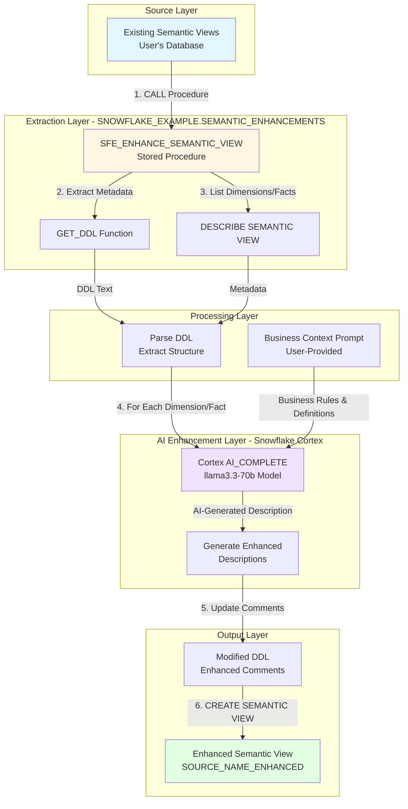

# Data Flow - Better Descriptions

**Author:** SE Community  
**Last Updated:** 2025-11-21  
**Status:** Reference Implementation


**Reference Implementation:** This code demonstrates production-grade architectural patterns and best practices. Review and customize security, networking, and logic for your organization's specific requirements before deployment.

## Overview

This diagram shows how semantic view metadata flows through the enhancement system, from extraction through Cortex AI enrichment to final enhanced view creation. The system uses Snowflake's native capabilities (GET_DDL, DESCRIBE, Cortex COMPLETE) to create enhanced copies of semantic views with AI-generated business-aware descriptions.

## Diagram



## Component Descriptions

### Source Layer

**Existing Semantic Views**
- **Purpose:** User's existing semantic views with basic or generic descriptions
- **Technology:** Snowflake Semantic Views (any database/schema)
- **Location:** Customer-defined location
- **Dependencies:** User must have SELECT privilege on source view

### Extraction Layer

**SFE_ENHANCE_SEMANTIC_VIEW Procedure**
- **Purpose:** Orchestrates the entire enhancement workflow
- **Technology:** Python stored procedure (Snowpark)
- **Location:** `SNOWFLAKE_EXAMPLE.SEMANTIC_ENHANCEMENTS.SFE_ENHANCE_SEMANTIC_VIEW`
- **Dependencies:** Snowpark Python runtime 3.11, Cortex service access
- **Parameters:**
  - `P_SOURCE_VIEW_NAME`: Source semantic view to enhance
  - `P_BUSINESS_CONTEXT_PROMPT`: Business context for AI enhancement
  - `P_OUTPUT_VIEW_NAME`: Optional custom name (default: `{SOURCE}_ENHANCED`)
  - `P_SCHEMA_NAME`: Optional schema (default: current)
  - `P_DATABASE_NAME`: Optional database (default: current)

**GET_DDL Function**
- **Purpose:** Extracts the complete DDL definition of the source semantic view
- **Technology:** Snowflake system function
- **Input:** `GET_DDL('SEMANTIC_VIEW', 'schema.view', TRUE)`
- **Output:** Full CREATE SEMANTIC VIEW statement as text
- **Dependencies:** User must have metadata access to source view

**DESCRIBE SEMANTIC VIEW**
- **Purpose:** Lists all dimensions, facts, and their current descriptions
- **Technology:** Snowflake metadata command
- **Output:** Table with columns: `name`, `kind` (DIMENSION/FACT), `comment`
- **Dependencies:** User must have DESCRIBE privilege

### Processing Layer

**Parse DDL**
- **Purpose:** Extracts structure and prepares for modification
- **Technology:** Python regex and string parsing
- **Location:** Within stored procedure logic (`sql/01_setup/00_setup.sql`)
- **Key Operations:**
  - Extract table references
  - Identify dimension/fact definitions
  - Fix unqualified table names (adds database.schema prefix)
  - Prepare string templates for comment replacement

**Business Context Prompt**
- **Purpose:** Provides domain-specific context to AI for generating descriptions
- **Technology:** User-provided text parameter
- **Format:** Unstructured business rules, code definitions, thresholds
- **Examples:**
  - Code definitions: "F=Fulfilled, O=Open, P=Processing"
  - Business rules: "Only fulfilled orders count toward revenue"
  - Thresholds: "Orders >$50K require VP approval"

### AI Enhancement Layer

**Cortex COMPLETE**
- **Purpose:** Generates business-aware descriptions using LLM
- **Technology:** Snowflake Cortex AI service
- **Model:** `llama3.1-70b` (optimal balance of quality and cost)
- **Location:** `SNOWFLAKE.CORTEX.COMPLETE` function
- **Dependencies:** Cortex service enabled in account, warehouse compute
- **Cost:** ~$0.02 per 10 dimensions/facts

**Generate Enhanced Descriptions**
- **Purpose:** Iterates through each dimension/fact and enhances description
- **Technology:** Python loop with SQL execution
- **Process:**
  1. For each dimension/fact
  2. Build prompt: `"Given context: {business_context}, enhance this description: {current_desc}"`
  3. Call Cortex COMPLETE
  4. Validate response (handle errors, limit length to 200 chars)
  5. Escape special characters for SQL
  6. Update DDL with new comment

### Output Layer

**Modified DDL**
- **Purpose:** DDL with all dimension/fact comments enhanced
- **Technology:** String manipulation in Python
- **Format:** Valid `CREATE SEMANTIC VIEW` statement
- **Transformation:** Old comments replaced with AI-enhanced versions

**Enhanced Semantic View**
- **Purpose:** New semantic view with improved descriptions
- **Technology:** Snowflake Semantic View
- **Location:** Same schema as source (or user-specified)
- **Naming:** `{SOURCE_VIEW_NAME}_ENHANCED` (or custom)
- **Storage:** No additional storage (view is metadata only)
- **Query Performance:** Identical to source (same underlying tables)

## Data Flow Steps

| Step | Input | Transformation | Output |
|------|-------|---------------|--------|
| 1. Invocation | User CALL statement | Parse parameters | Validated inputs |
| 2. Extraction | Source view metadata | GET_DDL + DESCRIBE | Raw DDL + dimension list |
| 3. Parsing | DDL text | Regex parsing, table qualification | Structured DDL components |
| 4. Enhancement | Each dimension/fact | Cortex AI with business context | Enhanced descriptions |
| 5. Assembly | Modified DDL | String replacement | Complete enhanced DDL |
| 6. Creation | Enhanced DDL | CREATE SEMANTIC VIEW | New enhanced view |

## Key Data Transformations

### Before Enhancement (Example)
```sql
DIMENSION O_ORDERSTATUS
  COMMENT 'Order status code'
```

### After Enhancement (Example)
```sql
DIMENSION O_ORDERSTATUS
  COMMENT 'Order fulfillment stage: F=Fulfilled (shipped to customer), O=Open (awaiting payment), P=Processing (in warehouse)'
```

## Performance Characteristics

| Metric | Value | Notes |
|--------|-------|-------|
| Processing Time | 2-4 sec/dimension | Depends on Cortex API latency |
| Typical View (10 fields) | ~30 seconds | 10 dimensions × 3 sec each |
| Large View (50 fields) | ~2-3 minutes | 50 dimensions × 3 sec each |
| Cost | <$0.02 per 10 fields | llama3.1-70b pricing |
| Storage Impact | 0 bytes | Views are metadata only |

## Error Handling

- **Missing source view:** Returns error with helpful message
- **Cortex unavailable:** Returns error, skips enhancement, keeps original comment
- **DDL creation fails:** Returns error with generated DDL for debugging
- **Partial failures:** Creates view with mix of enhanced/original comments, reports count

## Change History

See `.cursor/DIAGRAM_CHANGELOG.md` for version history.

---

**Last Review:** 2025-11-14  
**Next Review Due:** 2026-02-14 (90 days)

