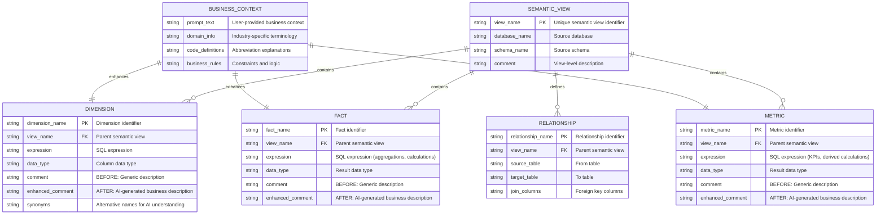

# Data Model - Better Descriptions

**Author:** SE Community  
**Last Updated:** 2025-11-21  
**Status:** Reference Implementation


**Reference Implementation:** This code demonstrates production-grade architectural patterns and best practices. Review and customize security, networking, and logic for your organization's specific requirements before deployment.

## Overview

This diagram shows the semantic view metadata structure that flows through the enhancement system. Unlike traditional data models showing tables and schemas, this tool operates on semantic view metadata (dimensions, facts, metrics) and enhances their descriptions using AI.

## Diagram



## Component Descriptions

### Semantic View (Source)

**SEMANTIC_VIEW**
- **Purpose:** Container for dimensions, facts, metrics, and relationships
- **Technology:** Snowflake Semantic View DDL
- **Location:** User's database (any schema)
- **Key Properties:**
  - `view_name`: Unique identifier (e.g., `ORDERS_SV`, `CUSTOMER_ORDERS_SV`)
  - `comment`: Overall view description
- **Enhancement:** View name gets `_ENHANCED` suffix for output

### Dimensions

**DIMENSION**
- **Purpose:** Categorical attributes for filtering and grouping
- **Technology:** Semantic view DIMENSIONS clause
- **Examples:**
  - `O_ORDERSTATUS`: Order status codes (F, O, P)
  - `O_ORDERPRIORITY`: Priority levels (1-URGENT, 2-HIGH, 3-MEDIUM)
  - `C_MKTSEGMENT`: Customer market segments
- **Enhancement Process:**
  1. Extract current `comment` (e.g., "Order status code")
  2. Combine with business context prompt
  3. Generate enhanced description via Cortex AI
  4. Result: "Order fulfillment stage: F=Fulfilled (shipped), O=Open (awaiting payment), P=Processing (warehouse)"

### Facts

**FACT**
- **Purpose:** Measurable numeric values and aggregations
- **Technology:** Semantic view FACTS clause
- **Examples:**
  - `O_TOTALPRICE`: Total order price amount
  - `line_item_count`: Count of items per order
  - `discounted_price`: Price after discount calculation
- **Enhancement Process:**
  1. Extract current `comment` and SQL `expression`
  2. Analyze data type (NUMBER, DECIMAL, etc.)
  3. Generate business-aware description
  4. Result includes units, business meaning, calculation logic

### Metrics

**METRIC**
- **Purpose:** Derived KPIs and business calculations
- **Technology:** Semantic view METRICS clause
- **Examples:**
  - `avg_order_value`: Average order price across customers
  - `total_revenue`: Sum of fulfilled orders only
  - `churn_rate`: Percentage of cancelled orders
- **Enhancement Process:**
  1. Extract metric expression and aggregation logic
  2. Apply business rules from context prompt
  3. Generate description with business significance
  4. Result explains when/how to use the metric

### Relationships

**RELATIONSHIP**
- **Purpose:** Defines foreign key relationships between logical tables
- **Technology:** Semantic view RELATIONSHIPS clause
- **Structure:**
  - Many-to-one relationships (orders → customers)
  - ASOF relationships for time-based joins
- **Enhancement:** Not directly enhanced (structural, not descriptive)

### Business Context (Input)

**BUSINESS_CONTEXT**
- **Purpose:** User-provided knowledge for AI enhancement
- **Technology:** String parameter to stored procedure
- **Required Content:**
  - **Code Definitions:** What abbreviations mean (F=Fulfilled, O=Open)
  - **Business Rules:** Important constraints (only fulfilled orders count toward revenue)
  - **Domain Context:** Industry-specific terms (SLA, VIP, commission tracking)
  - **Thresholds:** Important numeric boundaries ($50K requires approval)
- **Usage:** Applied to ALL dimensions/facts in one pass

## Enhancement Flow

### Before Enhancement

```
DIMENSION: O_ORDERSTATUS
├─ COMMENT: "Order status code"
├─ DATA_TYPE: VARCHAR(1)
└─ EXPRESSION: orders.O_ORDERSTATUS
```

### After Enhancement (with context: "F=Fulfilled, O=Open, P=Processing")

```
DIMENSION: O_ORDERSTATUS
├─ COMMENT: "Order fulfillment stage: F=Fulfilled (shipped), O=Open (awaiting payment), P=Processing (warehouse)"
├─ DATA_TYPE: VARCHAR(1)
└─ EXPRESSION: orders.O_ORDERSTATUS
```

## Metadata Schema (DESCRIBE Output)

When the procedure calls `DESCRIBE SEMANTIC VIEW`, it retrieves:

| object_kind | object_name | property | property_value |
|-------------|-------------|----------|----------------|
| VIEW | (null) | NAME | ORDERS_SV |
| TABLE | ORDERS | BASE_TABLE_DATABASE_NAME | SNOWFLAKE_SAMPLE_DATA |
| TABLE | ORDERS | BASE_TABLE_SCHEMA_NAME | TPCH_SF1 |
| TABLE | ORDERS | BASE_TABLE_NAME | ORDERS |
| DIMENSION | O_ORDERSTATUS | COMMENT | Order status code |
| DIMENSION | O_ORDERSTATUS | DATA_TYPE | VARCHAR(1) |
| DIMENSION | O_ORDERSTATUS | EXPRESSION | orders.O_ORDERSTATUS |
| FACT | O_TOTALPRICE | COMMENT | Total order price |
| FACT | O_TOTALPRICE | DATA_TYPE | NUMBER(38,2) |

This metadata drives the enhancement logic.

## Objects Created by This Tool

The tool creates minimal database objects:

### Database Objects

| Object Type | Name | Purpose |
|-------------|------|---------|
| Database | `SNOWFLAKE_EXAMPLE` | Container for all demo artifacts |
| Schema | `SEMANTIC_ENHANCEMENTS` | Namespace for enhancement tool |
| Warehouse | `SFE_ENHANCEMENT_WH` | Dedicated compute for AI operations |
| Stored Procedure | `SFE_ENHANCE_SEMANTIC_VIEW` | Main enhancement logic |

### No Traditional Tables

This tool does NOT create traditional data tables. It operates on:
- **Input:** User's existing semantic views (metadata only)
- **Output:** New semantic views with enhanced metadata
- **Storage:** No persistent data storage (transient processing only)

## Key Design Decisions

### Why Metadata-Only?

The tool enhances **descriptions** (metadata), not **data**:
- Reads: Semantic view DDL and metadata
- Processes: AI-generated descriptions
- Writes: New semantic view DDL with enhanced comments
- No user data is stored or processed

### Why Create Copies?

Original views remain unchanged for safety:
- Non-destructive operation
- Users can compare before/after
- Easy rollback (drop enhanced view)
- Iterative refinement supported

### Why AI Enhancement?

Manual metadata creation is time-consuming:
- AI understands business context
- Consistent terminology across views
- Captures tribal knowledge
- Scales to large semantic models

## Change History

See `.cursor/DIAGRAM_CHANGELOG.md` for version history.

