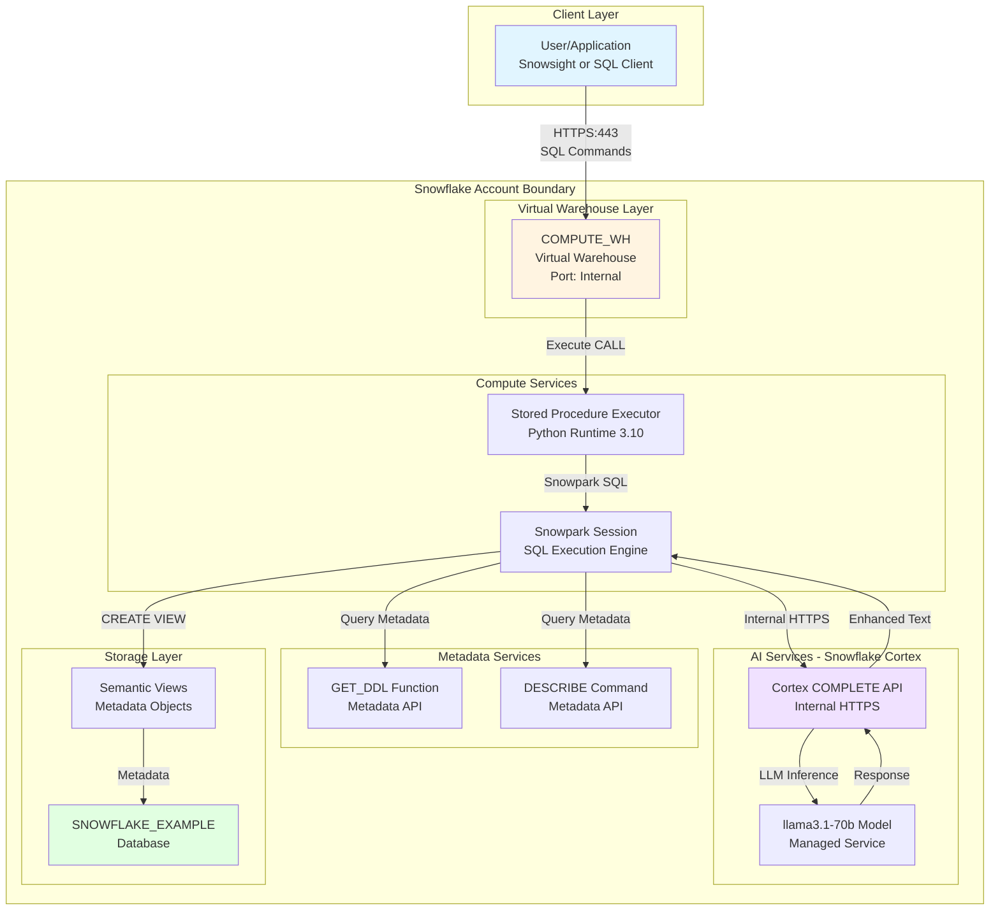

# Network Flow - Better Descriptions

**Author:** SE Community  
**Last Updated:** 2025-11-21  
**Status:** Reference Implementation


**Reference Implementation:** This code demonstrates production-grade architectural patterns and best practices. Review and customize security, networking, and logic for your organization's specific requirements before deployment.

## Overview

This diagram illustrates the network architecture and connectivity patterns for the Better Descriptions tool. The system operates entirely within Snowflake's managed infrastructure, leveraging internal services (Cortex AI, compute warehouses) and metadata APIs. No external network connections are required beyond standard Snowflake client access.

## Diagram



## Network Components

### Client Layer

**User/Application**
- **Protocol:** HTTPS (TLS 1.2+)
- **Port:** 443 (standard Snowflake connection)
- **Authentication:** Key-pair, OAuth, or username/password (configured in client)
- **Connection String:** `account_identifier.snowflakecomputing.com`
- **Clients Supported:**
  - Snowsight web UI
  - SnowSQL CLI
  - JDBC/ODBC drivers
  - Python Snowpark connector
  - Any Snowflake-compatible SQL client

### Virtual Warehouse Layer

**COMPUTE_WH (or custom warehouse)**
- **Purpose:** Provides compute resources for procedure execution
- **Size:** X-SMALL to MEDIUM (user-configurable)
- **Network:** Internal Snowflake managed network
- **Scaling:** Manual or auto-scale (depends on warehouse config)
- **Ports:** Internal only (no external exposure)
- **Security:** Managed by Snowflake, encrypted at rest and in transit

### Metadata Services

**GET_DDL Function**
- **Type:** System metadata function
- **Protocol:** Internal SQL execution
- **Access Control:** Requires metadata privileges on source view
- **Network Location:** Same availability zone as warehouse
- **Latency:** <1 second typical

**DESCRIBE Command**
- **Type:** System metadata command
- **Protocol:** Internal SQL execution
- **Access Control:** Requires DESCRIBE privilege on view
- **Network Location:** Same availability zone as warehouse
- **Latency:** <1 second typical

### Compute Services

**Stored Procedure Executor**
- **Runtime:** Python 3.10 (Snowpark)
- **Network Isolation:** Executes in isolated container
- **Dependencies:** Loaded from Snowflake Anaconda repository (internal)
- **Package:** `snowflake-snowpark-python` (pre-installed)
- **Memory:** Allocated from warehouse size
- **Timeout:** Warehouse session timeout (default 2 hours)

**Snowpark Session**
- **Purpose:** SQL execution engine for Python code
- **Protocol:** Internal API calls (not exposed externally)
- **Connection Pooling:** Managed by Snowflake
- **Transaction Scope:** Inherits from procedure invocation
- **Error Handling:** Automatic retry on transient failures

### AI Services - Snowflake Cortex

**Cortex COMPLETE API**
- **Endpoint:** `SNOWFLAKE.CORTEX.COMPLETE()` SQL function
- **Protocol:** Internal HTTPS (managed by Snowflake)
- **Network Location:** Same region as warehouse
- **Access Control:** Requires Cortex usage privilege
- **Rate Limiting:** Account-level quotas (managed by Snowflake)
- **Encryption:** TLS 1.3 in transit, encrypted at rest
- **Data Residency:** Processed in same region as account
- **SLA:** Snowflake service SLA applies

**llama3.1-70b Model**
- **Deployment:** Fully managed by Snowflake
- **Network:** No external access (internal inference service)
- **Latency:** 1-3 seconds per inference call
- **Availability:** Multi-AZ redundancy
- **Cost:** Per-token billing (input + output tokens)

### Storage Layer

**SNOWFLAKE_EXAMPLE Database**
- **Type:** Standard Snowflake database
- **Schema:** `SEMANTIC_ENHANCEMENTS`
- **Objects:** Stored procedures, semantic views (metadata only)
- **Storage:** No data storage (views are metadata, procedures are code)
- **Replication:** Follows account-level replication settings
- **Backup:** Included in Time Travel (1-90 days configurable)

**Semantic Views**
- **Type:** Metadata objects (no data storage)
- **Network Access:** Query through virtual warehouse only
- **Base Tables:** Reference existing tables (unchanged)
- **Performance:** Identical to source view (no overhead)

## Network Security

### Authentication

| Method | Supported | Recommended |
|--------|-----------|-------------|
| Username/Password | ✅ Yes | For interactive users |
| Key-Pair Authentication | ✅ Yes | **Recommended for automation** |
| OAuth | ✅ Yes | For SSO/enterprise auth |
| MFA | ✅ Yes | **Recommended for production** |

### Authorization

- **Role-Based Access Control (RBAC):** All access governed by Snowflake roles
- **Minimum Privileges Required:**
  - `USAGE` on database and schema
  - `CREATE PROCEDURE` on schema (for setup)
  - `SELECT` on source semantic views
  - `CREATE VIEW` on target schema
  - `USAGE` on warehouse
  - Cortex usage privilege (granted by ACCOUNTADMIN)

### Network Isolation

- **No External Endpoints:** All services internal to Snowflake
- **No Data Egress:** Data never leaves Snowflake environment
- **No Internet Access:** Stored procedure has no external network access
- **VPC/PrivateLink Support:** If configured at account level, applies to all connections

### Encryption

| Layer | Encryption Type | Standard |
|-------|----------------|----------|
| Client ↔ Snowflake | TLS 1.2+ | Industry standard |
| Warehouse ↔ Cortex | Internal TLS 1.3 | Snowflake managed |
| Data at Rest | AES-256 | Snowflake managed |
| Metadata | Encrypted | Snowflake managed |

## Network Flow Steps

### 1. User Invokes Procedure
```
User Client (port 443/TLS)
  ↓
Snowflake Load Balancer
  ↓
Virtual Warehouse (COMPUTE_WH)
  ↓
Stored Procedure Container
```

### 2. Metadata Extraction
```
Stored Procedure
  ↓ (Internal API)
GET_DDL / DESCRIBE Services
  ↓ (Internal Query)
Information Schema / Metadata Store
  ↓ (Response)
Stored Procedure
```

### 3. AI Enhancement
```
Stored Procedure
  ↓ (HTTPS Internal)
Cortex API Gateway
  ↓ (Internal RPC)
llama3.1-70b Inference Service
  ↓ (Response)
Cortex API Gateway
  ↓ (Response)
Stored Procedure
```

### 4. View Creation
```
Stored Procedure
  ↓ (SQL DDL)
Snowpark Execution Engine
  ↓ (Metadata Update)
SNOWFLAKE_EXAMPLE Schema
  ↓ (Catalog Update)
Information Schema
```

## Firewall & Network Policy

### No Special Rules Required

This tool requires **no firewall changes** or network policies beyond standard Snowflake access:

- ✅ Standard Snowflake client access (port 443)
- ✅ No inbound ports required
- ✅ No outbound connections required (beyond Snowflake service)
- ✅ No VPN required
- ✅ No additional whitelisting required

### If Snowflake Network Policies Exist

If your account has network policies configured:
- Ensure user's IP is allowed for Snowflake connection
- No additional policies needed for Cortex (internal service)

## High Availability & Disaster Recovery

### Availability Zones
- **Warehouse:** Multi-AZ by default (Snowflake managed)
- **Cortex Service:** Multi-AZ redundant deployment
- **Metadata Store:** Replicated across AZs

### Failure Scenarios

| Failure | Impact | Recovery |
|---------|--------|----------|
| Warehouse node failure | Automatic failover | <30 seconds |
| Cortex API transient error | Retry with exponential backoff | <5 seconds |
| Metadata service outage | Snowflake incident | Per Snowflake SLA |
| Entire AZ failure | Automatic failover to another AZ | <2 minutes |

## Performance Considerations

### Network Latency

| Path | Typical Latency | Notes |
|------|----------------|-------|
| Client → Snowflake | 10-100ms | Depends on client location |
| Warehouse → Metadata | <10ms | Same AZ, internal network |
| Warehouse → Cortex | 1-3 seconds | AI inference time dominates |
| Total per dimension | 2-4 seconds | Mostly Cortex inference |

### Bandwidth

- **Minimal:** Only SQL commands and text responses (KB range)
- **No large data transfers:** Views are metadata, no data movement
- **Cortex payloads:** Typically <10KB per API call

## Monitoring & Observability

### Query History
```sql
-- Monitor procedure execution
SELECT * FROM SNOWFLAKE.ACCOUNT_USAGE.QUERY_HISTORY
WHERE QUERY_TEXT ILIKE '%SFE_ENHANCE_SEMANTIC_VIEW%'
ORDER BY START_TIME DESC;
```

### Warehouse Metrics
```sql
-- Monitor warehouse usage
SELECT * FROM SNOWFLAKE.ACCOUNT_USAGE.WAREHOUSE_METERING_HISTORY
WHERE WAREHOUSE_NAME = 'COMPUTE_WH'
AND START_TIME >= DATEADD(DAY, -7, CURRENT_TIMESTAMP());
```

### Network-Related Errors

| Error Pattern | Network Cause | Resolution |
|--------------|---------------|------------|
| "Connection timeout" | Client network issue | Check client firewall/proxy |
| "Cortex service unavailable" | Temporary Cortex outage | Retry after brief delay |
| "Authentication failed" | Invalid credentials | Verify auth credentials |

## Change History

See `.cursor/DIAGRAM_CHANGELOG.md` for version history.

---

**Last Review:** 2025-11-14  
**Next Review Due:** 2026-02-14 (90 days)

