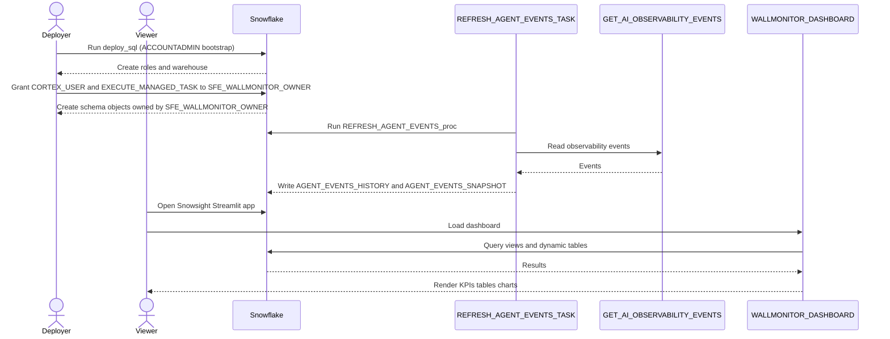

# Auth Flow - Wallmonitor
Author: SE Community
Last Updated: 2026-01-07
Expires: 2026-02-06 (30 days from creation)
Status: Reference Implementation

Reference Implementation: This code demonstrates production-grade architectural patterns and best practices. Review and customize security, networking, and logic for your organization's specific requirements before deployment.

## Overview
This diagram shows the privilege boundaries for deploying Wallmonitor, running ingestion, and viewing the Streamlit dashboard. Deployment bootstraps RBAC, then the owner role runs ingestion and owns objects while viewer roles have read-only access to the Streamlit app, views, and warehouse.

## Component Descriptions
- Purpose: Deployment and privilege setup
  Technology: Snowflake RBAC
  Location: `tools/wallmonitor/deploy.sql`
  Deps: Bootstrap role with ability to create roles/warehouse and grant privileges (demo uses `ACCOUNTADMIN`)
- Purpose: Observability event access
  Technology: Snowflake database role
  Location: `SNOWFLAKE.CORTEX_USER`
  Deps: Granted to the role running the ingestion task/procedure
- Purpose: Optional AI Observability event-table analytics access
  Technology: Snowflake application role
  Location: `SNOWFLAKE.AI_OBSERVABILITY_EVENTS_LOOKUP`
  Deps: Account-specific; required if enabling `SETUP_USAGE_ANALYTICS()`
- Purpose: Dashboard access
  Technology: Snowflake RBAC + Streamlit object privileges
  Location: Streamlit object in `SNOWFLAKE_EXAMPLE.WALLMONITOR`
  Deps: USAGE on database/schema/warehouse/streamlit + SELECT on views/tables (provided via `SFE_WALLMONITOR_VIEWER`)

## Change History
See `.cursor/DIAGRAM_CHANGELOG.md` for vhistory.
