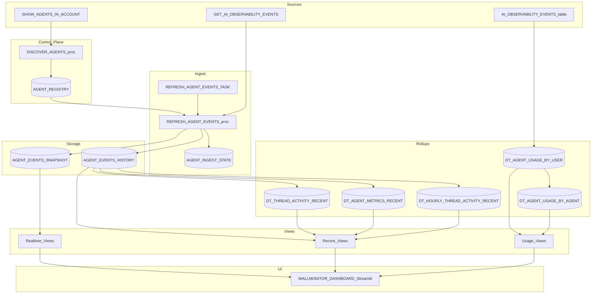

# Data Flow - Wallmonitor
Author: SE Community
Last Updated: 2026-01-07
Expires: 2026-02-06 (30 days from creation)
Status: Reference Implementation

Reference Implementation: This code demonstrates production-grade architectural patterns and best practices. Review and customize security, networking, and logic for your organization's specific requirements before deployment.

## Overview
This diagram shows how Cortex Agent observability events are discovered and ingested into Snowflake tables, then transformed into realtime and recent-history rollups consumed by a Streamlit-in-Snowflake dashboard.

## Component Descriptions
- Purpose: Agent discovery and registration
  Technology: `SHOW AGENTS` + SQL stored procedure
  Location: `tools/wallmonitor/deploy.sql` (`DISCOVER_AGENTS`)
  Deps: Privileges to enumerate agents and write registry table
- Purpose: Incremental ingest and snapshot rebuild
  Technology: Serverless task + SQL procedure
  Location: `tools/wallmonitor/deploy.sql` (`REFRESH_AGENT_EVENTS_TASK`, `REFRESH_AGENT_EVENTS`)
  Deps: `SNOWFLAKE.CORTEX_USER` database role
- Purpose: Recent-history rollups for dashboards
  Technology: Dynamic Tables
  Location: `tools/wallmonitor/deploy.sql` (`DT_*_RECENT`)
  Deps: `SFE_WALLMONITOR_WH` warehouse
- Purpose: Optional usage analytics (per-user / per-agent request metrics)
  Technology: Dynamic Tables derived from `SNOWFLAKE.LOCAL.AI_OBSERVABILITY_EVENTS`
  Location: `tools/wallmonitor/deploy.sql` (`SETUP_USAGE_ANALYTICS`, `DT_AGENT_USAGE_*`)
  Deps: AI Observability lookup privileges (account-specific)
- Purpose: Dashboard UI
  Technology: Streamlit in Snowflake
  Location: `tools/wallmonitor/deploy.sql` (uploads multi-page Streamlit source to stage and creates `WALLMONITOR_DASHBOARD`)
  Deps: Query warehouse and SELECT on views

## Change History
See `.cursor/DIAGRAM_CHANGELOG.md` for vhistory.
