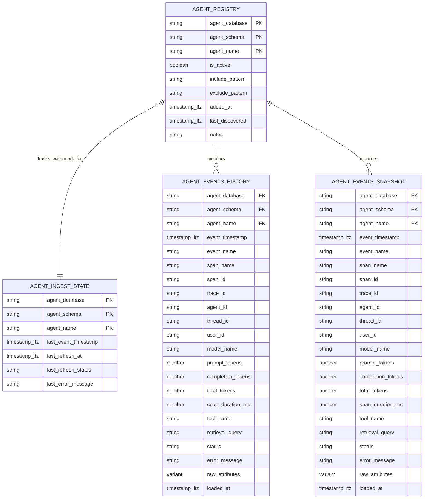

# Data Model - Wallmonitor
Author: SE Community
Last Updated: 2026-01-07
Expires: 2026-02-06 (30 days from creation)
Status: Reference Implementation

Reference Implementation: This code demonstrates production-grade architectural patterns and best practices. Review and customize security, networking, and logic for your organization's specific requirements before deployment.

## Overview
This diagram describes the core relational objects in `SNOWFLAKE_EXAMPLE.WALLMONITOR` used to monitor Cortex Agent observability events. It covers the agent registry, incremental ingest state, retained event history, and the realtime snapshot window used by dashboard views.

## Component Descriptions
- Purpose: Agent registry for monitoring scope
  Technology: Snowflake table
  Location: `tools/wallmonitor/deploy.sql`
  Deps: `SHOW AGENTS IN ACCOUNT` privileges for discovery
- Purpose: Incremental ingest watermark and status per agent
  Technology: Snowflake table
  Location: `tools/wallmonitor/deploy.sql`
  Deps: `REFRESH_AGENT_EVENTS()` procedure
- Purpose: Retained recent history used by dynamic tables (7-30 days)
  Technology: Snowflake table
  Location: `tools/wallmonitor/deploy.sql`
  Deps: `SNOWFLAKE.LOCAL.GET_AI_OBSERVABILITY_EVENTS()`
- Purpose: Realtime snapshot window used by realtime views
  Technology: Snowflake table
  Location: `tools/wallmonitor/deploy.sql`
  Deps: History retention window and refresh task

## Change History
See `.cursor/DIAGRAM_CHANGELOG.md` for vhistory.
