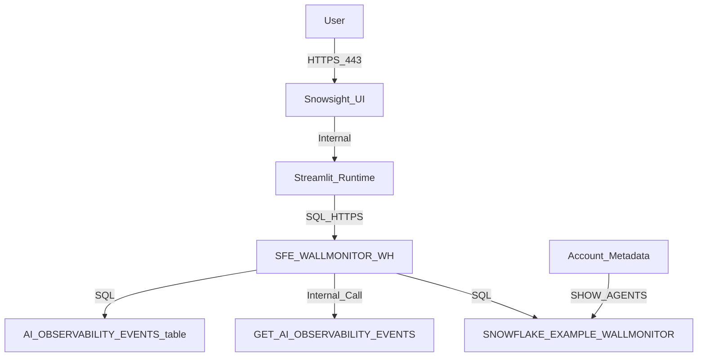

# Network Flow - Wallmonitor
Author: SE Community
Last Updated: 2026-01-07
Expires: 2026-02-06 (30 days from creation)
Status: Reference Implementation

Reference Implementation: This code demonstrates production-grade architectural patterns and best practices. Review and customize security, networking, and logic for your organization's specific requirements before deployment.

## Overview
This diagram shows the network interactions between the user in Snowsight, the Streamlit runtime in Snowflake, and Snowflake's internal services used to fetch Cortex Agent observability events. No external services are required by default.

## Component Descriptions
- Purpose: User interaction and app hosting
  Technology: Snowsight + Streamlit in Snowflake
  Location: Snowflake UI, `tools/wallmonitor/deploy.sql` (creates Streamlit object)
  Deps: User role access to the Streamlit object and query warehouse
- Purpose: Query execution
  Technology: Snowflake warehouse
  Location: `SFE_WALLMONITOR_WH` (created by `tools/wallmonitor/deploy.sql`)
  Deps: Warehouse usage grants for dashboard users (customer-specific)
- Purpose: Observability data retrieval
  Technology: `SNOWFLAKE.LOCAL.GET_AI_OBSERVABILITY_EVENTS`
  Location: Snowflake internal function
  Deps: `SNOWFLAKE.CORTEX_USER` database role
- Purpose: Optional usage analytics source
  Technology: `SNOWFLAKE.LOCAL.AI_OBSERVABILITY_EVENTS`
  Location: Snowflake internal event table
  Deps: AI Observability lookup privileges (account-specific)

## Change History
See `.cursor/DIAGRAM_CHANGELOG.md` for vhistory.
